# 第一章  初始Python

## 1.1Python库的使用

| **pip**命令示例                   | **说明**                       |
| --------------------------------- | ------------------------------ |
| **pip install Package**           | 安装 Package 模块文件          |
| **pip list**                      | 列出当前已安装的所有模块文件   |
| **pip install --upgrade Package** | 升级 Package 模块文件          |
| **pip uninstall Package**         | 卸载 Package 模块文件          |
| **pip install** **Package.whl**   | 使用轮子文件whl直接安装Package |

### 1.1.1模块的导入与使用

语法：import 模块名 [as 别名]

案例：

```python
import random		#导入random随机函数模块
random.randint(1,10)		#返回[1,10]之间的一个随机整数
9
import numpy as np		#导入模块numpy中的所有对象并设置别名
a = np.arange(1,10,2)		#通过别名来访问模块中的对象
a
array([1, 3, 5, 7, 9])
import os.path as path	#导入os模块中的path对象
path.exists("d:/programdata")	#使用path对象的exists方法
```

语法from 模块名 import 对象名 [as 别名]

案例：

```python
#导入random模块中的randint对象，并使用别名rt
from random import randint as rt	
rt(1,10)				#通过别名使用randint函数
#导入os模块中的path对象，并设置别名ph
from os import path as ph 	
ph.exists("d:/programdata")		#使用别名ph调用exists方法
```

### 1.1.2导入模块顺序（建议）

- 导入Python标准库模块
- 导入第三方扩展库
- 导入自己编写的本地模块

## 1.2程序组成和编码规范

### 1.2.1命名规则

- <font color='red'>变量名、包名、模块名</font>通常采用<font color='red'>小写字母开头</font>，如果名称中包含多个单词，一般采用第一个单词全部小写，后面每一个单词首字母大写的驼峰表示法，如myBook。也可以采用下划线_分隔的全部小写形式，如student_name。一些不变的对象，建议使用全大写方式，如PI。
- <font color='red'>类名采用首字母大写，多个单词使用驼峰表示法</font>，如BookInfo。
- <font color='red'>函数名一般采用小写字母</font>，多个单词使用驼峰表示法。

### 1.2.2代码缩进

==使用Tab键和空格来进行代码缩进，但是<font color='red'>不要混用Tab和空格</font>来缩进。==

### 1.2.3空格

函数或者语句块之间使用空格行来分隔，以分开两段不同功能的代码块，增强可读性。运算符两侧建议使用空格进行分隔。

### 1.2.4注释

#  第二章  Python语言基础

## 2.1标识符和关键字

### 2.1.1标识符

标识符是编程语言中允许作为名字的有效字符串集合。在命名标识符的时候，要遵循如下命名规则：

- 标识符的<font color='red'>第一个字符必须是字母或者下划线 _ </font>。
- 标识符可以由<font color='red'>字母、下划线 _ 或数字</font>组成。
- 标识符的语法基于Unicode standard annex UAX-31，可以使用中文字符作为标识符。
- 标识符<font color='red'>区分大小写</font>。
- 空格、跳格、换页等字符被用来分隔标识符。

注意:

- 标识符的长度不限。建议标识符不宜太长，否则不利于程序的编写。
- 禁止使用Python关键字（保留字）作为一般标识符。
- 标识符可以被用作变量名、函数名、类名、模块名等的命名。
- 标识符建议使用有意义的名字，能够体现其用途。

### 2.1.2关键字

关键字是Python语言本身使用的标识符，被Python<font color='red'>语言保留</font>，每个关键字都有其特殊的意义。如果被用来作为标识符，会导致语法错误。

| <font color='red'>False</font>  | <font color='red'>True</font>     | None                         | <font color='red'>and</font>   | <font color='red'>or</font>  |
| ------------------------------- | --------------------------------- | ---------------------------- | ------------------------------ | ---------------------------- |
| not                             | <font color='red'>as</font>       | with                         | from                           | import                       |
| while                           | for                               | <font color='red'>in</font>  | continue                       | break                        |
| try                             | <font color='red'>raise</font>    | finally                      | class                          | <font color='red'>def</font> |
| <font color='red'>global</font> | <font color='red'>nonlocal</font> | <font color='red'>del</font> | <font color='red'>yield</font> | except                       |
| if                              | else                              | elif                         | pass                           | return                       |
| <font color='red'>lambda</font> | async                             | assert                       | <font color='red'>await</font> | break                        |

## 2.2变量

### 2.2.1对象和类型(type()   id() )

在Python中处理的一切都是对象。对象是对数据的抽象，Python中所有的数据都被表示成对象，或者对象之间的关系，所有的数据以对象的形式存在。<font color='red'>非内置对象需要导入模块后才能使用</font>

每个对象都有一个id、类型和值。

<font color='red'>通过内置函数type()来获取对象的类型；id()函数获取对象的id（内存地址）；</font>

```python
 type(2)		#整型类型
<class 'int'>                    	#class表示类别
 type(43.56)		#浮点型
<class 'float'>
 hex(id(2))                 #对象2的内存地址
'0x7feedece370'
```

### 2.2.2变量的创建

<font color='red'>Python是一种强类型语言，不需要事先声明变量的类型（指向对象的类型），直接赋值即可创建各种类型的变量，变量类型会根据所赋值的类型自动推断。另外，Python是动态类型语言，变量的类型是可以随时变化的。</font>

#### 2.2.2.1变量的理解

- 变量在<font color='red'>第1次赋值时被创建</font>，再次出现时直接使用。
- <font color='red'>变量没有数据类型的概念</font>。数据类型属于对象，<font color='red'>类型决定了对象在内存中的存储方式和能够进行的操作</font>。例如，int类型上可以进行四则运算。
- <font color='red'>变量引用了对象</font>。当在表达式中使用变量时，变量被其引用的对象替代。
- <font color='red'>变量在使用前，必须赋初值</font>。Python中各种变量存储的不是值，而是值的引用。
- 注意：为了增加程序的运行效率，Python 3以后的解释器中<font color='red'>实现了小数字和字符串缓存的机制，小数字的缓冲范围是[-5 ~ 256]。</font>

### 2.2.3变量的删除(del)

Python会跟踪所有的变量，并自动删除不再有指向值的变量

通过显式使用del命令，可以删除不需要的变量，或者显式关闭不再需要访问的资源。

```Pyth
 a = 10
 del a					#删除变量a
 print(a)                 
错误代码:NameError: name 'a' is not defined
```

## 2.3数据类型

| 对象类型 | 名称                | 实例                         | 对象类型 | 名称     | 实例                    |
| -------- | ------------------- | ---------------------------- | -------- | -------- | ----------------------- |
| 数字     | int、float、complex | 123，3.1415，3+4j            | 集合     | set      | {"a","b","c"}           |
| 字符串   | str                 | ＂hello＂，'12'，'''语言'''  | 元组     | tuple    | (1,2,3)                 |
| 字节串   | bytes               | b'\xd6\xd0\xb9\xfa'          | 文件     |          | fn=open("name.txt",'r') |
| 列表     | list                | [1,2,3]，['a','b',['c','d']] | 布尔型   | bool     | True、False             |
| 字典     | dict                | {1:'a',2:'b'}                | 空类型   | NoneType | None                    |

​	Python支持四种基本<font color='red'>数字类型</font>，分别是<font color='red'>整型、布尔型、浮点型、复数型</font>，其中前两种是整型类型。Python中的<font color='red'>数字是无符号</font>的，所有的数字不包括符号“-”，符号“-”被看做一元运算符“-”。<font color='red'>浮点数很少返回精确的预期结果。</font>

​         <font color='red'>数字属于Python的不可变对象</font>，修改整型变量值的时候并不是真正修改变量的值，而是修改变量使其指向新值所在的内存地址。

​     为了增强数字的可读性，可以<font color='red'>在数字中间位置使用单个下划线作为分隔</font>。

​     在Python中，<font color='red'>数字类型变量所表示的范围可以是无穷大</font>，只要内存空间足够。和其它语言一样，Python也可以对数据类型进行等价转换。

```py
a= -100         #注意-为一元运算符
b = 8888_888_888_888_888_888          	#使用_提高可读性
c = b ** 5
print(c)
#55492895730664363466978272282341783947699029619468576944016528645701027959857718166268692103168
isinstance(True,int)  			#测试True是否为int的实例
True						
#True等价于整数1，False等价于整数0
```

## 2.4运算符

### 2.4.1算术运算符

| 运算符 | 含义                   | 举例         | 运算符 | 含义               | 举例   |
| ------ | ---------------------- | ------------ | ------ | ------------------ | ------ |
| +、-   | 加法、减法（集合差集） | 2 + 3,10 - 5 | **     | 幂运算             | 2 ** 3 |
| -      | 相反数                 | -6           | /      | 除法（真除法）     | 4 / 3  |
| *      | 乘法                   | 2 * 3        | //     | 求整商（向下取整） | 4 // 3 |
| %      | 求余数、指定字符串格式 | 5 % 2        |        |                    |        |

<font color='red'>Python不支持C语言中的自增（++）和自减（--）</font>

#### 2.4.1.1隐式/显式类型转换

不同数据类型在一起进行算术运算时，按照下面原则进行<font color='red'>隐式类型转换</font>：

-  当有一个操作数的类型是复数时，其它数据都自动转换成复数类型。
-  当有一个操作数的类型是小数时，其它数据都自动转换成小数类型。
-  不支持数字和字符之间的隐式转换。

还可以使用<font color='red'>内置函数进行显式转换</font>，转换时要保证类型要兼容，显式转换要丢失原数的精度。

```py
a = 3                                                d = 10 + 20j
a = a + 2.4                                          int(d)
type(a)                                              float('98.6')
<class 'float'>                                      #98.6
```

### 2.4.2逻辑运算符

​    逻辑运算符用来对布尔值进行<font color='red'>与、或、非等逻辑运算，运算最终结果是布尔值True和False</font>。     

​	其中，“非”是单目运算符，布尔“与”和“或”为双目运算符。

​    逻辑运算符的操作数都应该是布尔值，如果是其它类型的值，应该能够转换为布尔值才能进行运算。       

​	and：逻辑与； or：逻辑或；not：逻辑非。

### 2.4.3.关系运算符

 关系运算符包括:        

- 值比较符（<、<=、>、>=、!=、==）;        

- 身份比较符（is、is not）和成员测试符（in、not in）。        

- <font color='red'>值比较符比较两个操作数的大小并返回一个布尔值（True、False）</font>，操作数可以是数字和字符串。        

​	<font color='red'>身份比较符用于比较两个对象的内存位置是否相同,使用id()函数来确定。        </font>

​	<font color='red'>成员测试符用于查找对象是否在列表、元组、字符串、集合和字典等序列数据中。</font>

#### 2.4.3.1Python语言支持链式关系表达式，相当于多个表达式之间逻辑与的关系

```py
#Python语言支持链式关系表达式，相当于多个表达式之间逻辑与的关系。
 1 < 2 < 3					#等价于1 < 2  and 2 < 3
True
 2 >= 1 > 10                			#等价于2 >= 1 and 1 > 10
False

```

### 2.4.4位运算符

| 运算符 | 含义               | 举例  | 运算符 | 含义             | 举例  |
| ------ | ------------------ | ----- | ------ | ---------------- | ----- |
| &      | 按位与、集合交集   | 2 & 3 | \|     | 按位或、集合并集 | 2 & 6 |
| ^      | 按位异或、对称差集 | 2 & 6 | ~      | 按位取反         | ~10   |
| <<     | 按位左移           | 3<<2  | >>     | 按位右移         | 3>>2  |

### 2.4.5 矩阵相乘运算符(@)

矩阵相乘运算符@用于矩阵的乘法运算

```py
 import numpy as np                        			#导入numpy库
 x = np.array([1,2,3])                       			#创建数组
 y = np.array([[4,5,6],[7,8,9],[10,11,12]])
 z = x @ y                                 			#矩阵相乘
 z
array([48, 54, 60])
```

### 2.4.6. 赋值运算符

 	赋值运算符分为简单赋值运算符和增量赋值运算符。简单赋值运算符是指“=”，而增量赋值运算符是指算术运算符、逻辑运算符、位运算符中的双目运算符后面再加上“=”。     

 +=、-=、/=、//=、*=、**=、%=、<<=、>>=、&=、|=、^=；      

 =      		

## 2.5表达式

​		表达式是变量、数字、运算符、函数、括号等构成的有意义组合体，<font color='red'>表达式的返回值是一个单一的数字。</font>

​         在一个表达式中，Python会根据<font color='red'>运算符的优先级从低到高进行运算</font>。

​        <font color='red'>生成式>函数调用、下标、切片> 算术运算符>位运算符>关系运算符>逻辑运算符>lambda表达式</font>

## 2.6常用函数

### 2.6.1.  内置函数

执行`dir(__builtins__)`可以列出所有的内置函数;使用help(函数名)可以查看某个函数的用法;

`abs(x)`:返回数字x的绝对值或复数x的模;

`bin(x)`、`oct(x)`、`hex(x)`:把整数x转换为二进制、八进制、十六进制的表示形式

`bytes(x)`：把指定对象x转换为字节串表示形

<font color='red'>float(x)</font>：把整数或字符串x转换为浮点数；

<font color='red'>int(x[, d])</font>：返回实数（float）、分数（Fraction）或高精度实数（Decimal）x的整数部分，或把d进制的字符串x转换为十进制并返回，d默认为十进制；

<font color='red'>chr(x)</font>：返回Unicode编码为x的字符；ord(x)：返回1个字符x的Unicode编码；

<font color='red'>isinstance(obj, type)</font>：测试对象obj是否属于指定类型type；

<font color='red'>type(obj)</font>：返回对象obj的类型；

<font color='red'>max(x)、 min(x)</font>：返回可迭代对象x中的最大值、最小值；

<font color='red'>len(obj)</font>：返回对象obj包含的元素个数；

<font color='red'>id(obj)：</font>返回对象obj的标识（内存地址）；

<font color='red'>divmod(x, y)</font>：返回包含整商和余数的元组；

<font color='red'>enumerate</font>(iterable[, start])：返回包含元素形式为(0, iterable[0]), (1,                                                               iterable[1]) ...的迭代器对象；

<font color='red'>eval(s)</font>：计算并返回字符串s中表达式的值；

<font color='red'>range([start,] end [, step] )</font>：返回range对象，其中包含左闭右开区间[start,end)内以step为步长的整数，[start,end-1]

<font color='red'>map(func, *iterables):</font>返回包含若干函数值的map对象，函数func的参数分别来自于iterables指定的每个迭代对象;

<font color='red'>reversed(seq)</font>:返回seq中所有元素逆序后的迭代器对象;

<font color='red'>sorted(iterable, key=None, reverse=False):</font>返回排序后的列表，其中iterable表示要排序的序列或迭代对象，key用来指定排序规则或依据，reverse用来指定升序或降序，默认为升序。该函数不改变iterable内任何元素的顺序；

<font color='red'>sum(x, start=0)</font>：返回序列x中所有元素之和；

<font color='red'>exit()</font>：退出当前解释器环境；

### 2.6.2  模块函数

#### 2.6.2.1math模块

math模块提供了众多功能强大的数学函数，可以有效提高编程效率，使用这些函数时，需要使用import math导入math模块。

```py
import math
math.sin(math.pi)#sin
math.gcd(8,4)#最大公约数
math.trunc(13.9)#向下取整
math.pow(2,3)#乘方
math.floor(-13.9)#向下取整
```

#### 2.6.2.2random模块

| 函数名                               | 说明                                                  | 举例                                      |
| ------------------------------------ | ----------------------------------------------------- | ----------------------------------------- |
| random.random()                      | 返回[0.0,1.0]区间内的一个随机小数                     | random.random()返回0.9523521796999529     |
| random.uniform(a,b)                  | 返回[a,b]区间内的一个随机小数                         | random.uniform(1,3)返回2.3403540401554146 |
| random.randint(a,b)                  | 返回[a,b]区间内的一个随机整数                         | random.randint(1,3)返回2                  |
| random.randrange([start],end,[step]) | 返回[start,end)区间内的一个整数，start和step默认都是1 | random.randrange(1,10)返回5               |
| random.choice()                      | 随机返回给定序列中的一个元素                          | random.choice(['a','b','c'])返回'c'       |
| random.shuffle(x,[random])           | 将可变序列的所有元素随机排列                          | random.shuffle([1,2,3,4])返回[1, 4, 3, 2] |

## 2.7基本输入输出

### 2.7.1input函数

input( )的一般格式为：x = input(['提示'])

input()函数用来接收用户从键盘上的输入，不论用户输入数据时使用什么界定符，<font color='red'>input()函数的返回结果都是字符串，实际使用时需要将其转换为相应的类型再进行处理。</font>

### 2.7.2print函数

`print([objects][, sep=' '][, end='\n'][,file=sys.stdout][,flush=False])`

objects是输出的对象；

sep是对象之间插入的分隔符，默认是空格；

end是添加在输出文本最后的一个字符，默认是换行符；

file指定输出内容发送到的文件，默认是显示器；

flush指定输出的内容是否立即写文件。

#### 2.7.2.1输出一个或者多个对象

```py
print(123,"Python",[1,2,3])
123 Python [1, 2, 3]
```

#### 2.7.2.2指定输出分隔符

```py
print(123,"Python",[1,2,3],sep=';')
123;Python;[1, 2, 3]
```

#### 2.7.2.3指定输出结尾符号

```py
for i in [[1,2],[3,4],5]:
	print(i,end=";")
[1, 2];[3, 4];5;
```

#### 2.7.2.4指定输出文件

```py
print(123,"Python",[1,2,3],file= open(r'c:\test.txt','w'),flush=True)
```

#### 2.7.2.5指定格式化串

格式是：'<font color='red'>格式化串' %参数</font>，

```py
pi = 3.141592653 
 print('PI = %10.3f' % pi)     		#字段宽10，精度3 
PI = 3.142 
```

#  第三章  序列结构

## 3.2列表

​	    列表是Python内置的<font color='red'>有序、可变序列</font>，列表的<font color='red'>所有元素放在一对中括号“[]”中</font>，并使用逗号分隔开。        

​		当列表元素增加或删除时，列表对象<font color='red'>自动进行扩展或收缩内存</font>，保证元素之间没有缝隙。

​        在Python中，<font color='red'>一个列表中的数据类型可以各不相同</font>，可以同时为整数、实数、字符串等基本类型，甚至是列表、元组、字典、集合以及其他自定义类型的对象。

​        Python中<font color='red'>列表存放的元素是值的引用，并不直接存储值</font>，列表类似于其它语言的数组。<font color='red'>需要注意的是，列表的功能虽然非常强大，但是负担也比较重，开销较大，要尽量避免过多使用列表。</font>

### 3.2.1列表的创建和删除

方式一:将列表元素放置在一对<font color='red'>方括号[]内</font>，以逗号分隔，将这个列表赋值给变量，即可创建列表。

方式二:<font color='red'>使用list()函数</font>将元组、range对象、字符串或其他类型的可迭代对象类型的数据转换为列表。

当列表不再使用时，使用del命令删除整个列表。

```py
c = ["123",a,b]
d = list("abc")
list(range(1,10,2))
del c
```

### 3.2.2列表的赋值和拷贝

#### 3.2.2.1 浅拷贝

<font color='red'>浅拷贝会创建新对象，其内容是原对象的引用。</font>

<font color='red'>切片操作返回的是列表元素的浅拷贝</font>，也就是生成一个新的列表，并且把原列表中所有元素的引用都复制到新列表中。

<font color='red'>如果原列表中只包含整数、实数、复数等基本类型或元组、字符串这样的不可变类型的数据，一般是没有问题的（不会影响）。</font>

<font color='red'>如果原列表中包含列表之类的可变数据类型，由于浅拷贝时只是把子列表的引用复制到新列表中，这样的话修改任何一个都会影响另外一个。</font>

```py
a = [1,2,3,"welcome",["C","Java","PHP"]]
b = a.copy()		#浅拷贝a
a is b			#a、b指向不同的对象引用，内存地址不相同
#False

a[3] = "hello"   
b
#[1, 2, 3, 'welcome', ['C', 'Java', 'PHP']]
a[4].append("Python")	
b
#[1, 2, 3, 'welcome', ['C', 'Java', 'PHP', 'Python']]

```

#### 3.2.2.2深拷贝

 深拷贝拷贝两层。原始对象的改变不会造成深拷贝里任何子元素的改变，<font color='red'>使用copy模块中的deepcopy()函数。</font>

```py
import copy						
a = [1,2,3,"welcome",["C","Java","PHP"]]
b = copy.deepcopy(a)					
a is b  #False

a[4].append("Python")
b
#[1, 2, 3, 'welcome', ['C', 'Java', 'PHP']]
```

#### 3.2.2.3直接赋值

在python中，<font color='red'>对象赋值实际上是拷贝对象的引用</font>。当创建一个对象，然后把它赋给另一个变量的时候，python并没有拷贝这个对象，而只是拷贝了这个对象的引用。如果原始列表改变，被赋值的对象也会做相同的改变。

```PY
a = [1,2,"hello",["welcome","world"]]
b = a				#变量b复制a的对象引用
a[2] = "xi'an"			#修改列表内容
b
[1, 2, "xi'an", ['welcome', 'world']]	#修改列表内容
```

### 3.2.3列表的常用操作

#### 3.2.3.1转换其它数据类型到列表

使用<font color='red'>list()函数</font>可以完成对可迭代对象的列表转换，字符串对象可以通过<font color='red'>split()</font>完成到列表的转换。

```py
list("cat")					
['c', 'a', 't']
birthday = '07/28/1974'		
birthday.split("/")			#转化字符串到列表
['07', '28', '1974']
```

#### 3.2.3.2列表元素的访问与计数

列表元素的访问采用<font color='red'>lst[offset]</font>方式，offset可以是正整数，也可以是负整数。

   <font color='red'>当offset为正整数时，表示从列表头开始计数，0 ≤ offset ≤ len(lst) - 1。</font>

 <font color='red'>  当offset为负整数时，表示从列表末尾开始计数，len(lst) ≤ offset ≤ - 1。</font>

   当列表元素是序列时，可以采用二级下标方式`lst[offset1][offset2]`。

```py
a = [1,2,3,4,5,6,"abcd"]
a[0]                          1
a[-7] = 10                   [10, 2, 3, 4, 5, 6, 'abcd']
a[6][0]                       'a'
```

使用列表对象的<font color='red'>index()方法</font>获取指定元素首次出现的下标，<font color='red'>若列表对象中不存在指定元素，则抛出异常。</font>

```py
aList=[3, 4, 5, 5.5, 7, 9, 11, 13, 15, 17]
[3, 4, 5, 5.5, 7, 9, 11, 13, 15, 17]
aList.index(7)
4
```

#### 3.2.3.3列表元素的增加

​	列表元素的添加可以使用<font color='red'>append()、extend()和insert()</font>，或者<font color='red'>使用“+”运算符</font>。除了“+”运算符外，其它几个方法都属于<font color='red'>原地操作</font>。

- #####    append()方法

通过append()方法在当前<font color='red'>列表尾部追加元素</font>，是原地修改列表，速度较快。

```py
aList = [3, 4, 5, 6]
aList.append(7)
aList
#[3, 4, 5, 6, 7]
```


- ##### extend()方法

使用列表对象的extend()方法可以<font color='red'>将另一个迭代对象的所有元素添加至该列表对象尾部</font>。通过extend()方法来增加列表元素也不改变其内存首地址，属于原地操作。

```py
aList  = [1,2,3,4]
aList .extend([5,6])
aList 
[1, 2, 3, 4, 5, 6]
```

- #####  insert()方法

使用列表对象的<font color='red'>insert(index,x)</font>方法可以<font color='red'>将元素添加至列表的指定位置</font>。列表的insert()方法可以在列表的任意位置插入元素，但由于列表的自动内存管理功能，insert()方法会引起<font color='red'>插入位置之后所有元素的移动，这会影响处理速度</font>。

```py
aList .insert(3, 6)	      #在下标为3的位置插入元素6
aList 
[1, 2, 3, 6, 4, 5, 6]
```

- ##### 使用“+”运算符

如果是通过<font color='red'>“+”运算符来增加列表元素，实际上是创建了一个新列表</font>，并将原列表中的元素和新元素依次复制到新列表的内存空间。由于涉及大量元素的复制，该操作速度较慢，在<font color='red'>涉及大量元素添加时不建议使用该方法。</font>

```py
aList = [1,2,3]
aList = aList + [4,5]
aList
[1, 2, 3, 4, 5]
```

- ##### 使用“*”运算符

使用乘法*****来扩展列表对象，将列表与整数相乘，生成一个新列表，<font color='red'>新列表是原列表中元素的重复</font>。

当使用*****运算符将包含列表的列表重复并创建新列表时，当修改其中一个值时，相应的引用也会被修改。

```py
bList = [[1,2,3]] * 3
bList[0][0] = 4
bList
[[4, 2, 3], [4, 2, 3], [4, 2, 3]]
```

#### 3.2.3.4列表元素的删除

<font color='red'>使用del命令、使用列表对象的pop()方法、使用列表对象的remove()方法。</font>

使用<font color='red'>列表的pop()方法删除并返回指定位置（默认为最后一个）上的元素</font>，如果给定的下标超出了列表的范围则抛出异常。

使用<font color='red'>列表对象的remove()方法删除首次出现的指定元素</font>，如果列表中不存在要删除的元素，则抛出异常。

运行下面的程序，可以发现当循环结束后却发现并没有把所有的“1”都删除，只是删除了一部分。为什么会发生这种现象？

```py
x = [1,2,1,2,1,1,1]
for i in x:
	if  i == 1:
		x.remove(i)
x
#[2, 2, 1]
```

​		原因在于列表的<font color='red'>自动内存管理功能</font>。

​        当删除列表元素时，Python会自动对列表内存进行收缩并移动列表元素，以保证所有元素之间没有空隙，增加列表元素时也会自动扩展内存并对元素进行移动以保证元素之间没有空隙。<font color='red'>每当插入或删除一个元素之后，该元素位置后面所有元素的索引就都改变了。</font>

​		可以改变删除元素的方向，<font color='red'>从后向前删除</font>，当列表收缩时右侧元素的移位就不会造成元素索引位置变化导致的错误。

```py
#方法一 从后向前删除
x = [1,2,1,2,1,1,1]
for i in range(len(x)-1,-1,-1):             #从后往前删，下标范围[6,-1)
	if  x[i] == 1:
		del x[i]
x
#[2, 2]

#方法二 使用切片来完成
 x = [1,2,1,2,1,1,1]                                                     
 for i in x[::]:                                  #使用切片                 
    	if i == 1:                                                                	    x.remove(i) 
```

#### 3.2.3.5列表元素的排序和反转

实际中，经常需要对列表的元素进行排序，可以使用sort()和sorted()。

列表对象的sort()方法用于按照指定的规则对列表中所有元素<font color='red'>进行原地排序，该操作会改变原来列表元素的顺序。</font>

<font color='red'>sorted()排序后会生成新列表，原列表不会改变。    </font>

<font color='red'>reverse()方法用于将列表所有元素逆序或翻转。</font>

```py
a=[15, 8, 14, 16, 10, 19, 13, 18, 11, 17, 12, 9]				
b = sorted(a)			#产生新列表存放排序结果
a.sort(key=str)	                 #原地排序，指定排序依据根据字符串大小
a
#[10, 11, 12, 13, 14, 15, 16, 17, 18, 19, 8, 9]
a.reverse()		  #反转列表，原地操作
a
#[9, 8, 19, 18, 17, 16, 15, 14, 13, 12, 11, 10]
```

#### 3.2.3.6列表切片操作

使用语法“`list_name[start:end:step]`”来返回列表list_name的一个片段。

<font color='red'>第一个数字start表示切片开始位置，默认为0；</font>

<font color='red'>第二个数字end表示切片截止（但不包含）位置，默认为列表长度；</font>

<font color='red'>第三个数字step表示切片的步长，默认为1。</font>

<font color='red'>当start为0时可以省略，当end为列表长度时可以省略，当step为1时可以省略，省略步长时还可以同时省略最后一个冒号。</font>

<font color='red'>当step为负整数时，表示反向切片.-1表示列表最后一个元素的位置，其它以此类推。</font>

- ##### 使用切片获取列表的部分元素

  - 使用切片可以<font color='red'>返回列表中部分元素组成的新列表</font>。切片操作不会因为下标越界而抛出异常，而是简单地在列表尾部截断或者返回一个空列表，代码具有更强的健壮性。

```py
numbers = [1,2,3,4,5,6,7,8]
a = numbers[::]    #返回包含原列表中所有元素的新列表
#[1, 2, 3, 4, 5, 6, 7, 8]
numbers[::2]	#从第1个元素开始，隔1个取元素
[1, 3, 5, 7]
numbers[::-1]	#反向切片
#[8, 7, 6, 5, 4, 3, 2, 1]
numbers[1:3]	#指定切片开始位置和结束位置，步长默认为1
#[2, 3]
numbers[1::2]	#指定切片开始位置和步长，省略结束位置
#[2, 4, 6, 8]
```


- ##### 使用切片为列表增加/删除元素

  - 可以使用切片操作在列表任意位置插入新元素，但是并不影响列表对象的     内存地址，属于原地操作。

```py
numbers = [1,2,3,4,5,6,7,8]
a = numbers[::]    #返回包含原列表中所有元素的新列表
#[1, 2, 3, 4, 5, 6, 7, 8]
numbers[::2]	#从第1个元素开始，隔1个取元素
[1, 3, 5, 7]
numbers[::-1]	#反向切片
#[8, 7, 6, 5, 4, 3, 2, 1]
numbers[1:3]	#指定切片开始位置和结束位置，步长默认为1
#[2, 3]
numbers[1::2]	#指定切片开始位置和步长，省略结束位置
#[2, 4, 6, 8]
```

#### 3.2.3.7列表推导式

列表推导式使用<font color='red'>非常简洁的方式来快速生成满足特定需求的列表</font>，代码具有非常强的可读性。列表推导式语法形式为：

[expression for expr1 in sequence1 if condition1           

​				 for expr2 in sequence2 if condition2            

​				 for expr3 in sequence3 if condition3           

​                  ...           

​				 for exprN in sequenceN if conditionN ]

列表推导式在<font color='red'>逻辑上等价于一个循环语句</font>，只是形式上更加简洁。

```py
num = [ a * a for a in range(10) if a != 5]
num
#[0, 1, 4, 9, 16, 36, 49, 64, 81]
nation = [' China', ' France', 'England ']
aList = [s.strip() for s in nation]
aList
#['China', 'France', 'England']
a = [1,2,3]
b = [4,5,6]
c = [ x * y for x in a for y in b]#注意嵌套关系，第2个循环作为第1个循环的循环语句
c
#[4, 5, 6, 8, 10, 12, 12, 15, 18]
```

```py
vec = [[1,2,3], [4,5,6], [7,8,9]] 
[num for elem in vec for num in elem] 
[1, 2, 3, 4, 5, 6, 7, 8, 9] 

#等价于：
result = []
for elem in vec:
	  for num in elem:
		result.append(num)

```

##### 在列表推导式中使用多个循环，实现多序列元素的任意组合，并且可以结合条件语句过滤特定元素

```py
[(x, y) for x in range(3) for y in range(3)]
#[(0, 0), (0, 1), (0, 2), (1, 0), (1, 1), (1, 2), (2, 0), (2, 1), (2, 2)]

[(x, y) for x in [1, 2, 3] for y in [3, 1, 4] if x != y]
#[(1, 3), (1, 4), (2, 3), (2, 1), (2, 4), (3, 1), (3, 4)]
```

##### 使用列表推导式实现矩阵转置

```py
matrix = [ [1, 2, 3, 4], [5, 6, 7, 8], [9, 10, 11, 12]]   	#3*4矩阵 --->4*3矩阵 
[[row[i] for row in matrix] for i in range(4)] 

```

```py
[v ** 2 if v % 2 == 0 else v+1 for v in [2, 3, 4, -1] if v>0]
#[4, 4, 16]
x = list(range(10))
x
#[0, 1, 2, 3, 4, 5, 6, 7, 8, 9]
[item>5 for item in x]
#[False, False, False, False, False, False, True, True, True, True]
[p for p in range(2, 100) if 0 not in [p % d for d in range(2, int(p**0.5)+1)]]#获取2-100里面的素数
#[2, 3, 5, 7, 11, 13, 17, 19, 23, 29, 31, 37, 41, 43, 47, 53, 59, 61, 67, 71, 73, 79, 83, 89, 97]
```

#### 3.2.3.8列表成员测试

使用<font color='red'>in/not in运算符可以判断一个元素是否在列表中。</font>

```py
aList = [1,2,3]
a = 2
a in aList
True
4 not in aList
True
```

#### 3.2.3.9列表的比较

关系运算符（<、>、==、!=、<=、>=）也可以用来对列表进行比较。

```py
list1 = [1,2,3]
list2 = [2,5,6]
list1 > list2
False
list1 < list2
True
```

#### 3.2.3.10 多个列表的迭代

使用<font color='red'>zip()函数</font>可以完成对多个列表的迭代。

```py
days = ['Monday','Tuesday','Wednesday']
courses = ['math','english','computer','science']
for day,course in zip(days,courses):	#当最短的列表迭代完时，zip()将停止
    print(day,":study",course)
#Monday :study math
#Tuesday :study english
#Wednesday :study computer
```

## 3.3元组

列表和元组都属于<font color='red'>有序序列</font>，都支持使用双向索引访问其中的元素。

元组属于不可变（immutable）序列，<font color='red'>不可以直接修改元组中元素的值，也无法为元组增加或删除元素。</font>

<font color='red'>不能从元组中删除元素，而只能使用del命令删除整个元组。</font>

<font color='red'>元组也支持切片操作，但是只能通过切片来访问元组中的元素</font>，而不允许使用切片来修改元组中元素的值，也不支持使用切片操作来为元组增加或删除元素。

### 3.3.1元组的创建和删除

- #####  将元组元素放置在一对方括号()内，以逗号分隔，将这个元组赋值给变量，即可创建元组。

```py
t1 = (1,2,3)		#直接把元组赋值给一个变量
t1[1] = 10		#元组是不可改变
#Traceback (most recent call last):
#TypeError: 'tuple' object does not support item assignment
```


- ##### 也可以使用tuple()函数将元组、range对象、字符串或其他类型的可迭代对象类型的数据转换为列表。当不再使用时，使用del命令删除整个列表。

```py
t2 = (4)		#和t2 = 4是一样的
t3 = (4,)		#元组中只有一个元素，必须在后面多写一个逗号
t4 = tuple(range(5))	#将其他迭代对象转换为元组
t5 = ()					#空元组
color_tuple = 'Red','Green','Blue'		#多个元素时，可以省略()
color_tuple
('Red', 'Green', 'Blue')
del t4					#只能删除整个元组
del t4[1]					#不能删除元组元素
```

### 3.3.2元组的基本操作

可以使用下标访问元组的元素，支持两个方法count()和index()，提供in和not in运算符来判断元素是否在元组中，提供对元组进行切片等等。

```py
t = (1,2,3)
tt = tuple(range(4,7))
print("The second element in t is %d"%t[1])
#The second element in t is 2
ttt = t + tt			#元组连接
ttt
#(1, 2, 3, 4, 5, 6)
tttt = ttt[1:7]			#元组切片
tttt
#(2, 3, 4, 5, 6)
tttt.count(2)			#计算指定元素出现的次数
#1
tttt.index(5)			#计算指定元素第1次出现的下标
#3
(1,2,3) * 3				#元组可以数乘
#(1, 2, 3, 1, 2, 3, 1, 2, 3)
```

### 3.3.3生成器推导式

在形式上生成器推导式使用圆括号作为定界符。

与列表推导式最大的不同是，<font color='red'>生成器推导式的结果是一个生成器对象</font>。生成器对象类似于迭代器对象，<font color='red'>具有惰性求值的特点</font>，只在需要时生成新元素，<font color='red'>比列表推导式具有更高的效率，空间占用非常少，尤其适合大数据处理的场合。</font>

使用生成器对象的元素时，可以根据需要将其转化为列表或元组，也可以使用生成器对象的__next__()方法或者内置函数next()进行遍历，或者直接使用for循环来遍历其中的元素。

但是不管用哪种方法访问其元素，<font color='red'>只能从前往后访问每个元素，不可以再次访问已访问过的元素</font>，也<font color='red'>不支持使用下标访问其中的元素</font>。当所有元素访问结束以后，如果需要重新访问其中的元素，必须重新创建该生成器对象，<font color='red'>enumerate、filter、map、zip等其他迭代器对象也具有同样的特点</font>。

```py
gg = ((i + 2) ** 2 for i in range (10))	#创建生成器对象
gg					#生成器对象
#<generator object <genexpr> at 0x0000000002B7B9A8>
list(gg)		#将生成器对象转换为列表
#[4, 9, 16, 25, 36, 49, 64, 81, 100, 121]
tuple(gg)		#生成器对象已遍历结束，没有元素了
#()
g = ((i+2)**2 for i in range(10))		#重新创建生成器对象
g.__next__()	#使用生成器对象的__next__()方法获取元素
#4
```

## 3.4字典

字典（又被称为关联数组）是<font color='red'>包含若干“键:值”元素的无序可变序列</font>，字典中的每个元素包含用冒号分隔开的“键”和“值”两部分，表示一种映射或对应关系。定义字典时，所有的元素放在一对大括号“{}”中。

 字典中元素的<font color='red'>“键”可以是Python中任意不可变数据</font>，例如整数、实数、复数、字符串、元组等可哈希数据，<font color='red'>但不能使用列表、集合、字典或</font><font color='red'>其他可变类型作为字典的“键”</font>。另外，<font color='red'>字典中的“键”不允许重复，而“值”是可以重复的。</font>

### 3.4.1字典的创建和删除

- #### 使用赋值运算符“=”将一个字典赋值给一个变量，即可创建一个字典变量

```py
empty_dict = {}			#定义一个空字典
bierce = {				#定义一个非空字典
	"day":"A period of twenty-four hours",
	"positive":"Mistaken at the top of one's voice",
	"misfortune":"The kind of fortune that never misses"
	}

```

- #### 使用内置类dict以不同形式创建字典

```py
lot = [(1,'a'),(2,'b'),(3,'c')]		#定义一个列表
dict(lot)				#使用dict类转换列表到字典
{1: 'a', 2: 'b', 3: 'c'}
keys = ['a', 'b', 'c', 'd']
values = [1, 2, 3, 4]
dic = dict(zip(keys, values))	#根据已有数据创建字典
color_dict = dict(name = 'red',value = 0xff0000) #以关键参数的形式创建
```

### 3.4.2字典的赋值和拷贝

使用赋值符“=”时，任何对原字典的修改，都会影响到指向它的新字典。

使用copy()方法时，会产生一个新的字典，因此对原字典的修改，不会影响到新字典。

```py
dic1 = {"green":"go","yellow":"go slowly","red":"stop"}
dic2 = dic1
dic1["blue"] = "go fast"
dic2
{'green': 'go', 'yellow': 'go slowly', 'red': 'stop', 'blue': 'go fast'}
```

### 3.4.3字典的基本操作

#### 3.4.3.1字典元素的访问

使用<font color='red'>“键”作为下标就可以访问对应的“值”</font>，如果字典中不存在这个“键”会抛出异常。还可以<font color='red'>通过get()方法返回指定“键”对应的“值”，并且允许指定该键不存在时返回特定的“值”。</font>

使用keys()方法得到所有的“键”，使用values()方法得到所有的“值”，使用item()方法得到所有的“键”和“值”

```PY
aDict = {'年龄': 19, '成绩': [85, 90,68,72], '姓名': '王宁', 'sex': '男'}
aDict["年龄"]			#访问“键”对应的“值”
aDict.get('name', 'Not Exists.')					
'Not Exists.'
aDict = {'年龄': 19, '成绩': [85, 90,68,72], '姓名': '王宁', 'sex': '男'}	
aDict.keys()				#访问所有“键”
dict_keys(['年龄', '成绩', '姓名', 'sex'])
aDict.values()			#访问所有“值”
dict_values([19, [85, 90, 68, 72], '王宁', '男'])
aDict.items()			#返回整个字典内容
dict_items([('年龄', 19), ('成绩', [85, 90, 68, 72]), ('姓名', '王宁'), ('sex', '男')])
```

#### 3.4.3.2字典元素的添加

使用字典的<font color='red'>update()方法来添加元素</font>，还可以使用“键”的方式来增加元素。

```PY
aDict = {'年龄': 19, '成绩': [85, 90,68,72], '姓名': '王宁', 'sex': '男'}
aDict['年龄'] = 20
aDict['地址'] = "西安市长安区西京路1号"	   #使用键的方式添加元素
aDict.update({"电话":"13456789012"})#使用update()方法来增加元素
aDict
#{'年龄': 20, '成绩': [85, 90, 68, 72], '姓名': '王宁', 'sex': '男', '地址': '西安市长安区西京路1号', '电话': '13456789012'}
```

#### 3.4.3.3字典元素的修改

有两种方法，可以通过“键”的方式来赋值，或者使用update()方法。

```PY
aDict.update({"成绩":[80,90,68,72]})
aDict["成绩"] = [60,70,80,90]
aDict
#{'年龄': 20, '成绩': [60, 70, 80, 90], '姓名': '王宁', 'sex': '男', '地址': '西安市长安区西京路1号', '电话': '13456789012'}
```

#### 3.4.3.4字典元素的删除

删除字典元素可以使用del命令、使用字典对象的pop()和popitem()方法等方式。

如果要删除字典所有元素使用clear()方法。

```PY
del aDict["成绩"]
aDict.pop("sex")		#弹出指定键对应的元素
#'男'
aDict.popitem()		#弹出一个元素，对空字典会抛出异常
#('电话', '13456789012')
aDict.clear()
```

#### 3.4.3.5字典元素的排序

字段可以按照“键”或者“值”来进行排序。

items()将字典的元素转换成了包含元组的可迭代对象，取元组中的第二个元素进行比较

```PY
a = {"a":10,"c":1,"b":100}
#items()将字典的元素转换成了包含元组的可迭代对象，取元组中的第二个元素进行比较
sorted(a.items(),key = lambda item:item[1])	#按照“值”排序
#[('c', 1), ('a', 10), ('b', 100)]
```

## 3.5集合

集合（set）属于Python无序可变序列，使用一对大括号“{}”作为定界符，元素之间使用逗号分隔，<font color='red'>同一个集合内的每个元素都是唯一的，元素之间不允许重复。</font>

### 3.5.1集合的创建和删除

直接将集合赋值给变量，即可创建一个集合对象。

```PY
aSet = {1,2,3}
aSet
{1, 2, 3}
```

使用函数set()函数将列表、元组、字符串、range对象等可迭代对象转换为集合，<font color='red'>如果原来的数据中存在重复元素，则在转换为集合的时候只保留一个；如果原序列或迭代对象中有不可哈希的值，无法转换成为集合，则抛出异常。</font>

### 3.5.2 集合的基本操作

#### 3.5.2.1集合元素的增加

使用集合对象的add()方法可以增加新元素，如果该元素已存在则忽略该操作，不会抛出异常；update()方法用于合并另外一个集合中的元素到当前集合中，并自动去除重复元素。

```PY
s1 = {1,2}                                          s1.update([3,4])
s1.add(3)                                           s1
s1                                                  #{1, 2, 3, 4}
#{1, 2, 3}
```

#### 3.5.2.2集合元素的删除

pop()方法用于随机删除并返回集合中的一个元素，如果集合为空则抛出异常。

remove()方法用于删除集合中的元素，如果指定元素不存在则抛出异常。

discard()用于从集合中删除一个特定元素，如果元素不在集合中则忽略该操作。

clear()方法清空集合删除所有元素。

#### 3.5.2.3集合运算

集合之间可以进行交集“&”、并集“|”、差集“-”和对称差集“^”。

```PY
aSet = set(range(6))
aSet
{0, 1, 2, 3, 4, 5}
bSet = {5,6,7,8}
aSet & bSet				#集合交集
{5}
aSet | bSet				#集合并集
{0, 1, 2, 3, 4, 5, 6, 7, 8}

```

集合之间还可以比较大小。

```PY
a = {1,2,3,4,5,6}
b = {1,2,4}
a > b					#b是a的真子集
True
a == b								
False

```

## 3.6封装与拆封

 所谓元组的封装指的是<font color='red'>将多个值自动封装到一个元组</font>中。

元组封装的可逆操作称为序列的拆封，用来将<font color='red'>一个封装起来的序列自动拆分成若干个基本数据，可以使用序列拆封功能对多个变量同时进行赋值。</font>

```PY
t = "a","b","c"
t
#('a', 'b', 'c')
a,b,c = t
x, y, z = map(str, range(3))        #使用可迭代的map对象进行序列解包
x,y,z
#('0', '1', '2')
```

#  第四章  字符串

## 4.1字符串的编码方式

  Python 3.x完全支持中文字符，<font color='red'>默认使用UTF8编码格式，无论是一个数字、英文字母，还是一个汉字，在统计字符串长度时都按一个字符对待和处理。</font>

字符串属于不可变序列，意味着不可以直接修改字符串的值。

```PY
'Python语言'.encode('utf8')	              #采用UTF-8编码格式进行字符串编码
b'Python\xe8\xaf\xad\xe8\xa8\x80'	#字节编码
'Python语言'.encode('gb2312')			
b'Python\xd3\xef\xd1\xd4'
'Python语言'.encode('gb2312').decode('utf8')
#编码和解码格式不一致，导致错误
Traceback (most recent call last):
    UnicodeDecodeError: 'utf-8' codec can't decode byte 0xd3 in position 6: invalid continuation byte
'Python语言'.encode('gb2312').decode('gb2312')	
#编码和解码格式一致，正确显示内容
'Python语言'

len("Python语言")	#求字符串长度，中文字符和英文字符都算1个
8

s = "hello"
s[0] = "w"		#字符串是不可变序列，不允许直接修改其值
Traceback (most recent call last):
  TypeError: 'str' object does not support item assignment
id(s)   			#id() 表示内存地址
45901000
#修改字符串变量的值会导致重新创建一个对象，并指向这个对象
s = "Python"	
id(s)
30758648
```

## 4.2字符串的表示形式

### 4.2.1使用单引号' '包含字符

<font color='red'>单引号表示的字符串里面不能包含单引号，比如Let's go不能使用单引号包含。</font>

### 4.2.2使用双引号" " 包含字符

"PyCharm "    "ABC "    "北京"

注意：<font color='red'>双引号表示的字符串里面不能包含双引号，并且只能有一行</font>。

### 4.2.3使用三引号（三对单引号''' '''或三对双引号""" """）包含字符

三引号'''或"""表示的字符串可以换行，支持排版较为复杂的字符串，<font color='red'>包含在一对三引号之间而且不属于任何语句的内容被解释器认为是注释</font>。

'''

hello,world!

'''

<font color='red'>单引号、双引号、三单引号、三双引号可以互相嵌套，</font>用来表示复杂字符串。例如：'''Jack said, "I'm very good" '''

<font color='red'>前缀带r或者R的字符串表示Raw字符串（原始字符串）。</font>      

<font color='red'>Raw字符串中的所有字符都被看做普通字符，不会处理其中的转义字符。但是，字符串的最后一个字符不能是“\”。</font>

```py
path = 'C:\Windows\twunk.exe'
print(path)                        	#字符\t被转义为水平制表符
#C:\Windows	wunk.exe
#原始字符串，任何字符都不转义
path = r'C:\Windows\twunk.exe'
print(path)
#C:\Windows\twunk.exe
```

## 4.3字符串基本操作

### 4.3.1 字符串访问方式

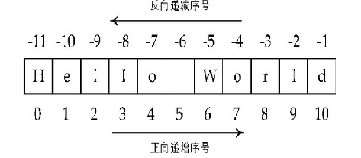

<font color='red'>Python字符串提供区间访问方式，采用[N: M]格式</font>

### 4.3.2 字符串的转义

如果需要在字符中使用特殊字符时，Python用反斜杠\。反斜杠字符是一个特殊字符，在字符串中表示“转义”。

| **转义字符** | **含义**                          | **转义字符** | **含义**                            |
| ------------ | --------------------------------- | ------------ | ----------------------------------- |
| **\\**       | **反斜线**                        | **\a**       | **响铃符**                          |
| **\ '**      | **单引号**                        | **\b**       | **退格符**                          |
| **\ "**      | **双引号**                        | **\f**       | **换页符**                          |
| **\n**       | **换行**                          | **\r**       | **回车符**                          |
| **\t**       | **水平制表符**                    | **\v**       | **垂直制表符**                      |
| **\ooo**     | **八进制表示的ASCII码对应的字符** | **\xhh**     | **十六进制表示的ASCII码对应的字符** |

空字符是作为一个普通字符进行处理。

```py
s = '\0\x61\101'  
#一个空字符、一个十六进制和一个八进制表示的ASCII字符
s
#'\x00aA'            	    	#非打印字符用十六进制表示
len(s)	     		#求字符串长度
#3
```

### 4.3.3基本操作符

| **操作符**                   | **描述**                                                |
| ---------------------------- | ------------------------------------------------------- |
| **x + y**                    | **连接两个字符串x与y**                                  |
| **x \* n** **或** **n \* x** | **复制n次字符串x**                                      |
| **x in s**                   | **如果x是s的子串，返回True，否则返回False，大小写敏感** |
| **str[i]**                   | **索引，返回第i个字符**                                 |
| **str[N: M]**                | **切片，返回索引第N到M的子串，其中不包含M**             |

```py
字符串的基本操作符示例如下：
s1 = "Hello" + " " + "Python"
print(s1)
Hello Python
s2 = "重要的事情说三遍！"*3
print(s2)
重要的事情说三遍！重要的事情说三遍！重要的事情说三遍！
s3 = 'Python' in s1
print(s3)
True
```

## 4.4字符串的方法

### 4.4.1字符串查找

<font color='red'>find()和rfind()函数分别用来查找一个字符串在另一个字符串指定范围（默认是整个字符串）中首次和最后一次出现的位置，如果不存在则返回-1；</font>

<font color='red'>index()和rindex()方法用来返回一个字符串在另一个字符串指定范围中首次和最后一次出现的位置，如果不存在则抛出异常；</font>

<font color='red'>count()方法用来返回一个字符串在当前字符串中出现的次数。</font>

```py
mystr = "Python is an excellent language"
index = mystr.find("an")
print(index)
10
index = mystr.find("programming")
print(index)
-1
index = mystr.index("excellent",0,30)
print(index)
13

str = "i love python,i am learning python"
print(str.count("i")) 			#star 和end 为默认参数
3
print(str.count("i",2))		                 # star值为2，end值为默认参数
2
```

### 4.4.2字符串分隔

<font color='red'>split()、rsplit()方法分别用来以指定字符为分隔符，把当前字符串从左往右、从右往左分隔成多个字符串，并返回包含分隔结果的列表。</font>

对于split()和rsplit()方法，如果不指定分隔符，则字符串中的任何<font color='red'>空白符号（空格、换行符、制表符等）</font>都将被认为是分隔符，把连续多个空白字符看作一个分隔符。

<font color='red'>partition()和rpartition()用来以指定字符串为分隔符将原字符串分隔为3部分：分隔符前面的字符串、分隔符字符串、分隔符后面的字符串</font>。如果指定的分隔符不在原字符串中，则返回原字符串和两个空字符串。

```py
str = 'WinXP||Win7||Win8||Win10'
print (str.split('||'))
#['WinXP', 'Win7', 'Win8', 'Win10']
print (str.split('||',2))			#指定最大分隔次数为2
#['WinXP', 'Win7', 'Win8||Win10']
str.partition("||")
#('WinXP', '||', 'Win7||Win8||Win10')
```

### 4.4.3字符串的连接

join()方法用来将列表中的多个字符串进行连接，并且在相邻两个字符串之间插入指定字符。

```py
test = ["I","love","Python"]
s = " ".join(test)	#指定插入字符为空格
s
#I love Python
#注意：使用“+”运算符也可以连接字符串，但是效率较低，应优先使用join()方法。
```

### 4.4.4字符串的大小写转换(lower upper capitalize title swapcase)

lower()返回小写字符串，upper()返回大写字符串，capitalize()将字符串首字符大写、title()将字符串中每个单词首字符大写、swapcase()完成大小写互换。

```py
s = "i am a teacher"
s.lower()
#'i am a teacher'
s.upper()
#'I AM A TEACHER'
s.capitalize()
#'I am a teacher'

 s.title()
#'I Am A Teacher'
 s.swapcase()
#'I AM A TEACHER'
```

### 4.4.5字符串替换(replace)

replace() 方法把字符串中的 old（旧字符串） 替换成 new(新字符串)，如果指定第三个参数max，则替换不超过 max 次。

### 4.4.6字符串删除(strip)

strip()删除字符串两端指定的字符，rstrip()删除字符串右端指定字符，lstrip()删除字符串左端指定字符。

```py
s = "  he is a student\t\t"
s.strip()   #删除s左右两端的空白字符
#'he is a student'
s.rstrip("\t")		     #删除s右端的\t的字符
#'  he is a student'
'aabbccddeeeffg'.strip('gaef')
#'bbccdd'
```

### 4.4.7字符串测试

isalnum()、isalpha()、isdigit()、isdecimal()、isnumeric()、isspace()、isupper()、islower()，分别测试字符串是否为数字或字母、是否为字母、是否为数字字符、是否为空白字符、是否为大写字母以及是否为小写字母。

```py
'1234abcd'.isalnum()
True
'1234abcd'.isalpha()         		#全部为英文字母时返回True
False
'1234abcd'.isdigit()        		#全部为数字时返回True
False
```

### 4.4.8 eval()

内置函数eval()尝试把任意字符串转化为<font color='red'>Python表达式并求值</font>。

```py
eval(" 10 * 2 / 5")
4.0
```

### 4.4.9 startswith()、endswith()

这两个方法用来判断字符串<font color='red'>是否以指定字符串开始或者结束</font>。

```py
"test.py".endswith((".py",".cpp",".java"))
True
"test.py".startswith("test",0)
True
```

### 4.4.10 center()、ljust()、rjust()

返回指定宽度的新字符串，原字符串居中、左对齐或右对齐出现在新字符串中，如果指定的宽度大于字符串长度，则使用指定的字符（默认为空格）填充。

```py
"let's begin".center(20,"+")
"++++let's begin+++++"
"let's begin".ljust(20,"-")
"let's begin---------"
```

## 4.5字符串常量

Python标准库string中定义了数字字符（string.digits）、标点符号（string.punctuation）、英文字母（string.ascii_letters）、大写字母（string.ascii_uppercase）、小写字母（string.ascii_lowercase）等常量。

```py
import string
string.digits
#'0123456789'
string.punctuation
#'!"#$%&\'()*+,-./:;<=>?@[\\]^_`{|}~'
string.ascii_letters
#'abcdefghijklmnopqrstuvwxyzABCDEFGHIJKLMNOPQRSTUVWXYZ'
```

## 4.6字符串的格式化

### 4.6.1 格式化表达式

#### 使用%

字符串格式化表达式用%表示，%之前是需要进行格式化的字符串，%之后是需要填入字符串中的实际参数。语法如下："%格式控制符"%实际参数

| **格式字符** | **转换**                             |
| ------------ | ------------------------------------ |
| **%c**       | 格式化字符及其ASCII码                |
| **%s**       | 格式化字符串                         |
| **%d**       | 格式化整数                           |
| **%f**       | 格式化浮点数字，可指定小数点后的精度 |
| **%o**       | 格式化无符号八进制数                 |
| **%x**       | 格式化无符号十六进制数（小写字母）   |

此外，格式化操作符还有如下辅助命令：

- m . n：m是数字的总宽度，n是小数位数；
- - ：用于左对齐；
- ：在正数前面显示加号；
- 0  ：显示的数字前面填充'0'取代空格。

```py
print('%f ' % 3.1415926)  			#默认保留6位小数
#3.141593
print('%20.2f' % 3.1415926)      
#返回的数字宽度是20位,留取2位小数,默认右对齐
#3.14
```

#### format()方法

<font color='red'><模板字符串>.format(<逗号分隔的参数>)</font>

格式说明符以“：”作为其前缀来表示。

```py
print('{}:计算机{}的CPU占用率为{}%.'.format('2019-01-30', 'Python', 10))
2019-01-30:计算机Python的CPU占用率为10%.
names=['Romeo','Juliet']
print('I am {args[0]}, I love {args[1]}.'.format(args=names))
I am Romeo, I love Juliet.
person = {'name': 'Liu', 'age': 24, 'job': 'Pythoneer'}
print('I am {person[name]}, {person[age]} years old, a {person[job]}.'.format(person=person))
I am Liu, 24 years old, a Pythoneer.
```

## 4.8案例实战

编写程序，生成100个4位数的验证码，随机挑选一个。

```py
import string       #导入string模块
import random  #导入随机数模块
characters = string.digits  #创建数字字符变量
def getRandomPwd(n):						
    #函数返回一个包含n个4位数的列表
    return [''.join((random.choice(characters) for _ in range(4))) for _ in range(n)] 
if __name__ == "__main__":    
    #随机从返回的列表样本中抽取1个四位数
    verifCode = random.sample(getRandomPwd(100),1)	
```

#  第五章  流程控制

## 5.1条件表达式

在<font color='red'>选择结构和循环结构中，常常需要对条件表达式的值进行判断</font>来确定下一步的执行流程。

<font color='red'>单个常量、变量或者任意合法表达式（包括函数调用表达式）都可以作为条件表达式。</font>

条件表达式中可以使用算术运算符、关系运算符、逻辑运算符、位运算符和矩阵相乘运算符等

- #### 条件表达式的值为False的情况 

False、0(0.0、0j)、None、空列表、空元组、空集合、空字典、空字符串、空range;对象或其它空迭代对象，Python解释器均认为等价于False。

- #### 条件表达式的值为True的情况 

条件表达式的值只要不是False，Python均认为与True等价。

<font color='red'>条件表达式中不能使用赋值运算符“=”否则会抛出异常。</font>

## 5.2选择结构

### 5.2.1单分支选择结构

if 条件表达式：

​	满足条件时要执行的语句块

注意：同一语句块的所有语句缩进相同。

```py
math = 65
print('开始进入if语句并判断表达式的值是否为True')
if math >= 85:              	#条件表达式
    print('数学成绩优秀')   	#if语句块，满足条件执行，否则不执行
print('if语句运行结束')     	#if语句结构外语句

```

## 5.2.2双分支选择结构的if…else语句

if 条件表达式：

​	   满足条件时要执行的语句块1

else：

   	不满足条件时要执行的语句2

```py
day = "正月初一"
if  day == "年三十":       	#if语句条件表达式
    print('今天是除夕')  	#if语句块，满足条件执行
else:                                 	#if语句块，不满足条件执行
    print('过年了')
    print('可以拿压岁钱了')
```

### 5.2.3多分支结构if…elif…else语句

if 条件表达式1：

​     满足条件1时要执行的语句块1

elif 条件表达式2：

​     满足条件2时要执行的语句块2

elif 条件表达式3：

​     满足条件3时要执行的语句块3

else：

​     不满足上述条件时执行的语句块4

```py
score = int(input("请输入你的分数："))
if  score >= 90 :
    print("你的等级是：A")
elif score >= 80 :
    print("你的等级是：B")
elif score >= 60 :
    print("你的等级是：C")
elif score >= 40 :
    print("你的等级是：D")
elif score >= 0 :
    print("你的等级是：E")
else:
    print("祝贺你已经完成成绩分级。")

```

### 5.2.4if嵌套

if 条件表达式1：

   	满足条件1时要执行的语句块1

​			if条件表达式2：

​	    		满足条件2时要执行的语句块块2

​	     	else：

​        		不满足条件2时要执行的语句块3

 else：   	

​		不满足条件1时要执行的语句块4

```py
message = ["你的成绩及格","你的成绩中等","你的成绩良好","你的成绩优秀","你的成绩不及格"]
score = int(input("请输入你的分数："))
if 0 <= score <= 100:
    index = (score - 60) // 10
    if index >= 0:
        print(message[index])
    else:
        print(message[-1])
else:
    print("错误的成绩，成绩必须在0和100之间")

```

## 5.3循环结构 

while

for

### 5.3.1while循坏和for循坏区别

- <font color='red'>while循环一般用于循环次数难以提前确定的情况，也可以用于循环次数确定的情况。</font>
- <font color='red'>for循环一般用于循环次数可以提前确定的情况，尤其是用于枚举序列或迭代对象中的元素。</font>
- <font color='red'>一般优先考虑使用for循环。</font>
- <font color='red'>相同或不同的循环结构之间都可以互相嵌套，实现更为复杂的逻辑。</font>

### 5.3.2while循坏和for循坏语法结构

while循环常见用法:

while 条件表达式：

​		循环体


 for循环常见用法:

 for  <循环变量>  in  <可迭代对象或迭代器>：

​         循环体


else子句常见用法

​		for...else语法形式如下：

​				for  <循环变量>  in  <可迭代对象或迭代器>：

​					    	循环体

​				else:

​					    	代码块


​		while...else语法形式如下：

​				while 条件表达式：

 				      	循环体

​				else:  

​					   	代码块

```py
count = 0				#初始化循环控制变量
while count < 5:		#条件表达式的值为True时，执行循环体
    print (count, " is less than 5")	#注意缩进要一致
    count += 1		             	#循环控制变量自增，避免死循环
else:
    print (count, " is not less than 5")	#表达式的值为False时执行else语句块

    
name  = ["XiJing","University"]	     #定义一个列表
for c in name:			     #遍历列表中的每一个元素
    if c == "XiJing":					
       print("founded!")
     else:
       print("The search is complete")	     #遍历完列表的元素后执行print
```

### 5.3.3循环结构的优化

在编写循环语句时，<font color='red'>应该尽量减少循环内部不必要的计算，将与循环变量无关的代码尽可能放到循环体的外面。</font>

```py
#优化前的代码：
digits = (1, 2, 3, 4)
result = []
for i in range(1000):     
    for i in digits:
        for j in digits:
            for k in digits:
                result.append(i*100+j*10+k)   #i,j,k各执行执行1000 * 4 **3次
```

```py
#优化后的代码：
digits = (1, 2, 3, 4)
result = []
for i in range(1000):
    for i in digits:
        i = i * 100       				#i执行1000 * 4次
        for j in digits:
            j = j * 10			#j执行1000 * 4 ** 2次
            for k in digits:
                result.append(i + j + k)	#k执行1000 * 4 ** 3次
```

## 5.4break和continue语句 

<font color='red'>break和continue只能在循环中使用，不能单独使用</font>

在嵌套循环中，<font color='red'>break和continue只对最近的一层循环起作用</font>

例子:求i除以2的余数，如果余数为0结束当次循环，继续执行后续循环；如果余数不为0则打印i，并判断如果i >=7就结束整个循环，执行循环后语句。

```py
for i in range(10):
    if i % 2 == 0:
        continue
    print(i,end=",")
    if i >= 7:
        break
    else:	#由于break会提前跳出循环体，所以else子句不会得以执行
        print("循环结束")		
```

## 5.5案例实战

### 5.5.1打印空心等边三角形的程序

先定义一个变量rows记录等边三角形边长，用循环嵌套和if-elif-else语句控制等边三角形边上点的位置。

```py
rows = int(input("输入行数:"))
for i in range(0, rows):					 #i控制每一行
    for k in range(0, 2 * rows - 1):				 #k控制每一行中的列数
        if (i != rows - 1) and (k == rows - i - 1 or k == rows + i - 1):   #控制每行打印*的位置
            print (" * ", end="\t")
        elif i == rows - 1:		#最后一行
            if k % 2 == 0:					
                print(" * ", end="\t")
            else:
                print ("  ", end="\t")
         else:			#控制每行打印空格的位置
            print ("  ", end="\t")
    print ("\n")
```


### 5.5.2打印九九乘法表

使用两层循环完成任务，外层循环控制打印的行数，内层循环控制打印的列数和值。

```py
print("九九乘法表")
i = 1                                     		#外层循环控制变量初始化
for i in range(1,10):
    j = 1                                 	#内层循环控制变量初始化    
    for j in range(1,i+1):                       
        print("%d *%d = %-2d" % (i, j, i * j), end='  ')
        j += 1
    print("\n")
    i+= 1
```


### 5.5.3输出50以内的勾股数，要求每行显示6组，各勾股数无重复。

可以采用多<font color='red'>种循环的穷举算法</font>来完成，但是要尽量减少内层循环中无关的计算，对循环进行必要的优化。

```py
import time
start = time.time()
n = 0
for i in range(1,50):
    a = i ** 2				#为了减少执行次数
    for j in range(i +1,50):
        b = j ** 2				#为了减少执行次数
        for c in range(j + 1,50):
            if a + b == c ** 2:
                print("%2d,%2d,%2d  "%(i,j,c),end='')
                n += 1
                if n % 6 == 0:
                    print("\n")
print("执行时间:",time.time() - start) 

```

#  第六章  自定义函数

## 6.1函数的定义

函数不仅可以<font color='red'>实现代码的复用</font>，还可以保证<font color='red'>代码的一致性</font>。Python将<font color='red'>函数的声明和定义视为一体</font>。

def 函数名([参数列表]):

​             函数体

-  自定义函数通过<font color='red'>关键字def来定义</font>，<font color='red'>通过return语句指定返回值</font>。
-  函数可以<font color='red'>通过return语句同时返回多个值</font>，如果没有return语句，则函数返回值为<font color='red'>None</font>。
-  函数名命名规则与变量名相同，不能是关键字，应该避免函数名和变量名同名。
-  函数的第1行称为<font color='red'>函数头，必须以冒号:结束</font>，其余部分称为函数体，而<font color='red'>函数体必须缩进</font>。按照惯例，缩进总是4个空格。
-  函数<font color='red'>形参不需要声明类型，也不需要指定函数返回值类型</font>。
-  当函数不需要任何参数时，也<font color='red'>必须保留一对空的圆括号</font>。
-  Python允许<font color='red'>嵌套定义函数</font>。

- 函数的<font color='red'>形参和返回值可以是任何数据类型</font>，包括函数。
- 可以使用<font color='red'>pass</font>关键字，表示函数什么也不做，起到占位的作用。
-  定义函数时，建议设置其<font color='red'>docstring</font>，提供函数的帮助文档。可以通过函数名?或者help(函数名)看到这些docstring，<font color='red'>使用三双引号来定义docstring</font>。
-  用Python编写的函数，在Jupyter notebook中可以通过“<font color='red'>函数名??</font>”来显示源代码。

```py
def myfun1(a,b):
    """
       	这是一个函数嵌套定义，完成a*(a+b)功能
    """
    n = a + b
    def myfun2(c,d):                     	#函数的嵌套定义
        return c * d
    return myfun2(n,a)                  	#调用内部函数
```

## 6.2函数的调用

### 6.2.1函数的调用方式

可以通过“<font color='red'>函数名(实参)</font>”的方式来调用

如果函数有返回值，那么可以在函数调用的同时将返回值传递出来，此时这个函数调用可以当做一个值来使用。

```py
result = myfun1(5,4)	
#函数调用时实参传递给形参，如果实参是表达式，先计算表达式的值，然后再传递给形参
result
#45
```

### 6.2.2特殊的内置函数

#### 6.2.2.1map()

map()函数接受一个函数f和一个序列sq，其<font color='red'>作用是将函数f作用在序列的每个元素上</font>，等价于[f(x) for x in sq]。

```py
list(map(int,"123"))	#将字符串中的每个字符应用int()函数，转换为整型数
[1, 2, 3]
```

#### 6.2.2.2filter()

filter()函数也接受一个函数f和一个序列sq，其作用是<font color='red'>通过函数f来筛选序列中的每个元素</font>，等价于[x for x in sq if f(x)]。

```py
def is_odd(x):
    return x % 2 != 0
list(filter(is_odd,[1,2,3,4,5,6]))
[1, 3, 5]

```

#### 6.2.2.3 reduce()

reduce()函数接受一个二元操作的函数f和一个序列sq，实现<font color='red'>对序列sq中的元素累加计算，并返回单一结果</font>。注意：reduce()使用时<font color='red'>需要引入functools模块</font>。

```py
from functools import reduce
def add(x,y):
    return max(x,y)			#求x，y的最大者
reduce(add,[10,-10,100,200,1,2])
200
```

## 6.3函数的参数

 函数定义时，圆括弧内是使用逗号分隔开的形参列表，函数可以有多个参数，也可以没有参数，<font color='red'>形参只是起到占位的作用。</font>

定义函数时不需要声明参数类型，解释器会<font color='red'>根据实参的类型自动推断形参类型</font>。

  如果传递给函数的<font color='red'>实参是</font>整数、实数、复数等基本类型或元组、字符串这样的<font color='red'>不可变类型的数据</font>，在函数内部直接修改形参的值<font color='red'>不会影响实参</font>，而是创建一个新变量。

如果传递给函数的<font color='red'>实参是可变序列</font>，并且在函数内部<font color='red'>使用下标或可变序列自身的方法增加、删除元素或修改形参元素时，实参也会得到相应的修改。</font>

```py
def sub(num):
    print("操作前，形参地址是:%0x"%id(num))
    num -= 1
    print("操作后，形参地址是:%0x"%id(num))
test = 100
print("实参地址是:%0x"%id(test))
sub(test)
#实参地址是:52557a40
#操作前，形参地址是:52557a40
#操作后，形参地址是:52557a20
```

```py
def add(s):
    s.append(10)
t = [1,2,3]
add(t)
t
#[1, 2, 3, 10]
    
def modify(lst):
    print("操作前，形参的地址是:",hex(id(lst)))
    lst = [4,5,6]		#lst指向一个新的内存地址
    print("操作后，形参的地址是:",hex(id(lst)))
a = [1,2,3]
modify(a)

```

### 6.3.1位置参数

位置参数是最常用的形式，调用函数时<font color='red'>实参和形参的顺序以及必须严格一致，并且实参和形参的数量必须相同。</font>

```py
def menu(food,cigarette,wine):
    print("主食:",food,"香烟:",cigarette,"白酒:",wine)
menu("面条","红塔山","郎酒")
#主食: 面条 香烟: 红塔山 白酒: 郎酒
```

### 6.3.2默认值参数

在调用带有默认值参数的函数时，<font color='red'>可以不用为设置默认值的形参进行传值</font>，此时函数将会直接使用函数定义时设置的默认值，当然也可以<font color='red'>通过显式赋值来替换其默认值。在调用函数时是否为默认值参数传递实参是可选的。</font>

需要注意的是，在定义带有默认值参数的函数时，任何一个<font color='red'>默认值参数右边都不能再出现没有默认值的普通位置参数</font>，否则会提示语法错误。

def 函数名(……，形参=默认值):

​      函数体

<font color='red'>多次调用函数并且不为默认值参数传递实参时，默认值参数只在定义时进行一次解释和初始化。因此，对于列表、字典这样可变类型的默认值参数，可能会导致逻辑错误</font>

```py
def buggy(arg,result = []):
    result.append(arg)
    print(result)
buggy(3,[1,2])
#[1, 2, 3]
buggy(3)     
# [3]
buggy(4)
#[3, 4]
```

<font color='red'> 一般来说，要避免使用列表、字典、集合等可变序列作为函数参数默认值</font>，对于上面的函数，更建议使用下面的写法。

```py
def buggy(arg,result = None):
    if result is None:
        result = []
    result.append(arg)
    print(result)
```

### 6.3.3关键参数

关键参数指<font color='red'>调用函数时的参数传递方式，与函数定义无关</font>。通过关键参数可以<font color='red'>按照参数名字传递值，明确指定哪个值传递给哪个参数，实参的顺序可以和形参的顺序不一致，并不影响参数值的传递结果。</font>

```py
def menu(food,wine,cigarette)
	print("主食: {0} 香烟: {1} 白酒: {2}".format(food,cigarette,wine))
menu(wine="茅台",food="米饭",cigarette="好猫")
#主食: 米饭 香烟: 好猫 白酒: 茅台
#还可以混合位置参数和关键参数，但是要确保位置参数在关键参数的左边。
menu("米粉",wine="五粮液",cigarette="云烟")
#主食: 米粉 香烟: 云烟 白酒: 五粮液
```

### 6.3.4可变长度参数

Python支持在函数定义时可以使用<font color='red'>个数不确定的参</font>数。

可变长度参数主要有两种形式：在参数名前加*或**。 

*parameter用来接收多个<font color='red'>位置参数</font>并将其放在<font color='red'>一个元组</font>中。

 **parameter用来接收<font color='red'>多个关键参数</font>并将其存放到一个<font color='red'>字典</font>中

```py
def print_args(arg1,arg2,*pargs,**kargs):
    print("arg1 is ",arg1)
    print("arg2 is ",arg2)
    for eachpargs in pargs:
        print("additional position arg: ",eachpargs)
    for key,value in kargs.items():
        print("additional keyword arg: %s :%s"%(key,value))
print_args("主食","面条","白酒","汾酒",香烟="芙蓉王")
'''
arg1 is  主食
arg2 is  面条
additional position arg:  白酒
additional position arg:  汾酒
additional keyword arg: 香烟 :芙蓉王
'''
```

## 6.4函数的返回值

在Python中，定义函数时不需要声明函数的返回值类型，<font color='red'>函数返回值类型与return语句返回表达式的类型一致</font>。return语句结束函数的执行。

Python支持同时<font color='red'>返回多个值，多个值以元组的形式返回。</font>

```py
def adddiv(a,b):
    a,b = a + b,a / b
    return a,b		#返回一个元组，包含a和b的值
add,sub = adddiv(10,3)		#元组的拆封
print("参数之和是：%d,参数相除是:%.2f"%(add,sub))
#参数之和是：13,参数相除是:3.33
```

## 6.5lambda表达式

lambda表达式可以用来<font color='red'>声明匿名函数</font>，也就是没有函数名字的临时使用的函数。

`lambda  <variables>:<expression>`

其中variables是函数的参数，expression是函数的返回值，它们之间用冒号:分隔。

 lambda表达式<font color='red'>只可以包含一个表达式</font>，不允许包含选择、循环等语法结构，该<font color='red'>表达式的计算结果可以看作是函数的返回值</font>，不允许包含复合语句，但在表达式中可以调用其他函数。

```py
f = lambda x,y,z:max(x,y,z)
f(10,20,30)
#30
L = [1,2,3,4,5]
print(list(map(lambda x: x+10, L)))
#[11, 12, 13, 14, 15]
def demo(n):
    return n * n
list(map(lambda x:demo(x)+2,(1,2,3,4)))	#使用函数作为lambda表达式的返回值
#[1, 4, 9, 16]
```

```py
from random import sample                                 #导入random包中的sample模块
data = [sample(range(100),6) for i in range(3)]   
for row in data:
    print(row)
#[22, 62, 82, 50, 36, 99]
#[62, 19, 72, 88, 82, 25]
#[28, 27, 92, 63, 20, 5]
for row in sorted(data,key=lambda row:row[0]): #按照每行的第一个元素升序排列
    print(row)
#[22, 62, 82, 50, 36, 99]
#[28, 27, 92, 63, 20, 5]
#[62, 19, 72, 88, 82, 25]
```

## 6.6生成器

生成器（generator）是<font color='red'>创建迭代器（iterator）对象</font>的一种简单而强大的工具。生成器的语法和普通函数一样，只是<font color='red'>返回数据时需要使用yield语句而非return语句。</font>

生成器在每次执行到yield语句时，会返回一个中间的结果给调用者，之后会暂停或挂起后面代码的执行，下次通过生成器对象的`__next__()`方法、内置函数next()、for循环遍历生成器对象元素或其他方式显式获取数据时，它会准确地从离开地方继续执行。

```py
def my_range(first=0,last=10,step=1):
    number = first
    while number < last:
        yield number       #暂停执行，需要时再产生一个新元素
        number += step
ranger = my_range(1,6)
for x in ranger:			#迭代生成器对象
    print(x,end = '\t')
#1	2	3	4	5
```

## 6.7装饰器

<font color='red'>装饰器（decorators）本质上是一个输入参数是函数，并且返回值也是函数的函数。</font>

装饰器的语法结构如下:      

@装饰器名字(可选函数名)      

def 被装饰的函数名(可选参数):

...

可以同时使用多个装饰器，这时@操作符必须一行一个

```py
def document(func):                       #定义一个名为document的装饰器
    def new_function(*pargs):
        print("Running function:",func.__name__)
        print("Positional arguments:",pargs)
        result = func(*pargs)
        print("result:",result)
        return new_function
@document			          #装饰器作用在函数add_ints函数上
def add_ints(a,b):
    return a + b
add_ints(10,20)
'''
Running function: add_ints
Positional arguments: (10, 20)
result: 30
'''
```

#  第七章 面向对象编程

## 7.1类和对象

面向对象编程实质就是对 “类” 和 “对象” 的使用。

 类：就是一个模板，模板里可以包含多个方法和属性。

对象：根据模板创建的实例，通过实例对象可以执行类中的方法。

### 7.1.1  类的定义

类由三部分组成：

<font color='red'>类名</font>：类的名称，它的首字母一般大写。

<font color='red'>属性</font>：用于描述类的特征，也称为数据成员。例如：人有姓名、年龄等。

<font color='red'>方法</font>：用于描述类的行为，也称为方法成员。例如：人具有运动、说话等行为。

类的定义语法如下：

class  <类名>( ): 

​	<类的属性>

​	<类的方法>

### 7.1.2  创建对象

创建对象的语法格式如下：

<font color='red'>对象名 = 类名( )</font>

要想给对象添加属性，可以通过如下方式：

<font color='red'>对象名.新的属性名 = 值</font>

```py
class Person():			#定义类
    def eat(self):			#定义方法
        print("吃肉夹馍...真香呀...")
    def run(self):
        print("8百米体测达标...呼哧...")

person = Person()		#定义对象，并用person变量保存它的引用
person.name = "张三"	#添加表示姓名的属性
person.age = 18		#添加表示年龄的属性
person.eat()			#调用方法
person.run()
print(person.name,person.age)	#打印属性值
```

### 7.1.3  self参数

<font color='red'>类的所有实例方法都必须至少有一个名为self的参数，并且必须是方法的第一个形参（如果有多个形参）。self参数表示对象本身。</font>

<font color='red'>在类的实例方法中访问实例属性时需要以self为前缀，但在方法外通过对象名调用对象方法时并不需要传递这个参数。如果在外部通过类名调用对象方法则需要显式为self参数传递值。</font>

## 7.2属性和方法

### 7.2.1  属性

属性分为两种：<font color='red'>类属性和实例属性。</font>

<font color='red'>类属性是在类中所有方法之外定义的数据成员；</font>

<font color='red'>实例属性一般是指在构造函数__init__()中定义的，定义和使用时必须以self作为前缀；在类的外部，实例属性属于实例对象，只能通过对象名访问；而类属性属于类，可以通过类名或者对象名访问。</font>

<font color='red'>类属性被所有类的实例对象(实例方法)所共有，在内存中只存在一个副本。</font>

在Python中定义私有成员<font color='red'>只需要在属性名或方法名前加上 “__” 双下划线，那么这个属性或方法就是私有的了。</font>

<font color='red'>私有属性在类外不能直接访问，需要通过调用对象的公有方法来访问，</font>或者通过Python支持的特殊方式来访问，可以对象名.类名__xxx方式来访问私有的类属性。

```py
class Person():
    	name = "Tom"  		#公有的类属性
    	__age = 12    		#私有的类属性
p = Person()						
print(p.name)  		#通过对象访问公有类属性
#Tom
print(Person.name) #通过类访问公有类属性
#Tom		
print(p.__age)         #错误，不能在类外通过实例对象访问私有的类属性
#Traceback (most recent call last):
#AttributeError: 'Person' object has no attribute '__age'
print(p._Person__age)  	 # 访问类的私有属性，一般不推荐
#12

```

### 7.2.2  方法

Python类的方法分为实例方法，类方法和静态方法。

#### 7.2.2.1实例方法

<font color='red'>第一个参数</font>必须是实例对象，该<font color='red'>参数名一般约定为“self”</font>，通过它来传递实例的属性和方法（也可以传递类的属性和方法）；只能由实例对象调用。

#### 7.2.2.2类方法

<font color='red'>使用装饰器@classmethod来修饰一个方法</font>，此时该方法就是类方法。类方法的第一个参数必须是当前类对象，该<font color='red'>参数名一般约定为“cls”</font>，通过它来传递类的属性和方法（不能传实例的属性和方法）；实例对象和类对象都可以调用。

#### 7.2.2.3静态方法

<font color='red'>使用装饰器@staticmethod来修饰一个方法，此时该方法就是静态方法。静态方法的参数随意，没有“self”和“cls”参数，但是方法体中不能使用类或实例的任何属性和方法；实例对象和类对象都可以调用。</font>

实例方法只能被实例对象调用，类方法和静态方法可以被类或类的实例对象调用。

```py
class Foo(object):
          def instance_method(self):		#定义实例方法
        	  print("这是类{}的普通实例方法，只能被实例对象调用".format(Foo))
          @classmethod			#定义类方法
          def class_method(cls):
        	  print("这是类方法")
          @staticmethod			#定义静态方法
          def static_method():
                print("这是静态方法")
foo = Foo()
foo.instance_method()	         #通过对象名来调用实例方法
#这是类<class '__main__.Foo'>的普通实例方法，只能被实例对象调用
```

## 7.3构造方法和析构方法

Python提供了两种特殊的方法：__init__()和__del__ ()，分别用于初始化对象属性和释放类所占用的资源，即构造方法和析构方法。

### 7.3.1  构造方法

Python提供了一个特殊的方法`__init__()`，被称为类的构造函数或初始化方法，当创建了这个类的实例时就会调用该方法。

```py
class Person():			#定义类
    	def __init__(self):			#构造方法
        	    self.name = "张三"
        	    self.age = 18
    	def run(self):
        	    print("%d岁的%s进行8百米体测达标...呼哧..."%(self.age,self.name))
person = Person()		#定义对象，并用person变量保存它的引用

```

无论创建多少个Person对象，name和age属性值初始默认都为“张三”和18。

<font color='red'>如果要在对象创建完成后修改属性的默认值，可以在构造方法中传入参数设定属性的值。</font>

```py
class Person():
    	def __init__(self, name, age):	#带参数的构造方法
        	    self.name = name
        	    self.age = age
person1 = Person("张三",18)	#定义对象，同时传入实参
person1.run()
#18岁的张三进行8百米体测达标...呼哧...
person2 = Person("李四",20)
person2.run()
#20岁的李四进行8百米体测达标...呼哧...

```

### 7.3.2  析构方法

在python中，对于开发者来说很少会直接销毁对象(如果需要，应该使用del关键字销毁)。 Python的内存管理机制能够很好的胜任这份工作。也就是说，<font color='red'>不管是手动调用del还是由python自动回收都会触发`__del__`方法执行。</font>

```py
class Person():
    	def __init__(self, name, age):
        	self.name = name
    	    self.age = age
    	def __del__(self):		#定义析构方法
        	print("调用del方法删除对象")
mickey = Person("米老鼠",18)	#定义对象，同时传入实参
del mickey			             #显式调用__del__()方法
#调用del方法删除对象
```

## 7.4封装

在面向对象的程序设计中，<font color='red'>封装（Encapsulation）是对具体对象的一种抽象，即将某些部分隐藏起来，在程序外部看不到，其含义是其他程序无法调用。</font>

<font color='red'>封装数据的主要原因是保护隐私，封装方法的主要原因是隔离复杂度。	</font>

```py
class Person():
    def __init__(self, name, age):
        	self.name = name
        	self.__age = age  		#私有属性
    def setAge(self, age):			#给私有属性赋值
        	self.__age = age
    def getAge(self):			#获得私有属性的值
        	return  self.__age
laosun = Person("悟空",18)
print(laosun.__age)
#AttributeError: 'Person' object has no attribute '__age‘
#把print(laosun.__age)代码改为setAge和getAge方法，分别对私有属性进行赋值和取值的操作。
laosun.setAge(20)
print(laosun.getAge())
#20 
```

## 7.5继承

通过继承创建的新类称为子类或派生类，被继承的类称为基类、父类或超类。语法格式如下：

class 子类名(父类名):

​      语句块

如果类定义时，<font color='red'>没有基类列表，等同于继承自object</font>，在Python3中，object类是所有对象的根基类。例如class Person 等同于class Person(object)。

### 7.5.1  单继承

所谓单继承，就是子类继承了一个父类（基类） 。

<font color='red'>父类的私有属性和私有方法是不会被子类继承的，更不能被子类访问。</font>

```py
class Animal(object):			#定义一个动物类
    	def __init__(self, color):
        	    self.color = color
    	def run(self):
        	    print("Animal is running... ")
class Dog(Animal):				#定义一个动物的子类－狗类
 	pass #空语句
class Cat(Animal):				#定义一个动物的子类－猫类
    	pass #空语句
dog = Dog("黑色")
print("狗的颜色",dog.color)
#狗的颜色 黑色
dog.run()
#Animal is running...
cat = Cat("白色")
print("猫的颜色",cat.color)
#猫的颜色 白色
cat.run()
#Animal is running...
```

### 7.5.2 多继承

<font color='red'>子类继承了多个父类（基类）</font>

多继承的语法格式如下：

class 子类名(父类名1，父类名2，…): 

​         	语句块

```py
class KungFu:	# 定义一个父类
    	def printKungfu(self):
  	    			print('----功夫----')
class Panda:				#定义另一个父类
    	def eat(self):
        	       	print('----吃竹子----')
    	def __init__(self, color ):
        	      	self.color = color
class KungFuPanda(KungFu,Panda):	 	#定义一个子类
        def eat(self):#重写父类的方法
        	    	print('----吃包子----')    	
        def __init__(self, color, duan): 		#重写父类的方法
        	        super().__init__(color)		#调用父类的init方法
                    self.duan = duan #增加段位属性
Po = KungFuPanda('黑白',"六段")	#定义功夫熊猫阿宝
Po.eat()
#----吃包子----
print("%s颜色的功夫熊猫阿宝的武功段位是%s"%( Po.color, Po.duan))
#黑白颜色的功夫熊猫阿宝的武功段位是六段

```

子类同时继承了多个父类的方法并可调用，也可以调用自己创建的方法；调用重写父类的方法eat时，只会调用子类重写的方法，不再调用父类的方法eat，即<font color='red'>优先调用子类中重载过的方法；使用super调用父类的构造方法`__init__`。</font>

## 7.6多态

多态是指<font color='red'>不同的子类对象调用相同的父类方法，产生不同的执行结果</font>，可以增加代码外部调用的灵活性。多态的特征是以继承和重写父类方法为前提，是调用方法的技巧，不会影响到类的内部设计。

```py
class Animal():			#定义一个动物类
    def __init__(self, name):
        self.name = name
    def talk(self):  			#抽象方法，仅由约定定义
        print(self.name, '叫！')  		# 当子类没有重写talk方法的时候调用
    def animal_talk(obj):  			# 多态
        obj.talk()
class Dog(Animal):		#定义一个动物的子类－狗类
    def talk(self):		# 重写父类的talk方法
         print('%s: 汪！汪！汪！' % self.name)
class Cat(Animal):		#定义一个动物的子类－猫类
    def talk(self):# 重写父类的talk方法
         print('%s: 喵喵喵!' % self.name)
animal = Animal('动物')
dog = Dog('狗狗')
cat = Cat('猫咪')
Animal.animal_talk(animal) 			
#动物 叫！
dog.animal_talk()    		#多态调用
#狗狗: 汪！汪！汪！
Animal.animal_talk(cat)    		#多态调用
#猫咪: 喵喵喵!
```

从结果可以看出，当子类和父类都存在相同的 talk方法时，子类的talk 方法覆盖了父类的talk方法，在代码运行时，会根据参数（不同类型对象）的不同，会调用不同子类的 talk方法。多态的好处就是，当我们需要传入更多的子类，例如新增Bird、Cattle等时，我们只需要继承Animal类型就可以了，只要确保新方法编写正确，而不用管原来的代码。

#  第八章 异常处理

## 8.1错误与异常

 Python至少有两类不同的错误：<font color='red'>语法错误（Syntax Errors）和异常（Exceptions）。</font>

语法错误，也叫解析错误

<font color='red'>如果程序出错Python解释器会指出出错的一行，并且在最先找到的错误的文字进行标记颜色或小箭头。</font>

<font color='red'>一个语句或者一个表达式即使编译时是没有语法错误的，但是也有可能在执行时出现问题，这种问题也叫异常（非致命性），异常通常都是有在程序中进行处理的。异常是有不同类型的，</font>这类异常称为<font color='red'>标准异常</font>。

还有一类异常是用户<font color='red'>自定义</font>的。

## 8.2异常类

在Python中，<font color='red'>所有的异常类都是Exception的子类</font>，且都在exceptions模块中定义。Python自动将所有异常名称放在内建命名空间中，所以程序不必导入exceptions模块即可使用异常。Python 常见异常类型如表所示。

| **异常名称**          | **描述**                     |
| --------------------- | ---------------------------- |
| **Exception**         | 常规错误的基类               |
| **BaseException**     | 所有异常的基类               |
| **ZeroDivisionError** | 除(或取模)零 (所有数据类型)  |
| **NameError**         | 未声明/初始化对象 (没有属性) |
| **SyntaxError**       | 语法错误                     |
| **IndexError**        | 序列中没有此索引(index)      |
| **KeyError**          | 映射中没有这个键             |
| **FileNotFoundError** | 文件未找到                   |
| **AttributeError**    | 对象没有这个属性             |
| **ValueError**        | 传入无效的参数               |

## 8.3异常处理

Python解释器检测到程序出现的错误，触发异常，需要编写特定的代码去进行异常处理，用来捕捉这个异常（这段代码与程序逻辑无关，与异常处理有关）。如果捕捉成功则进入另外一个处理分支，执行为其定制的逻辑，使程序不会崩溃，这就是异常处理。

### 8.3.1  捕获指定异常(try...except)

ython的异常捕获常用try...except结构，把可能发生错误的语句放在try模块里，用except来处理异常，<font color='red'>每一个try，都必须至少对应一个except。</font>

try...except语法格式如下：

try:

​    可能引发异常的代码块

except  异常类型名称:

​    异常处理代码块

```py
s = "Hello Python!"
try:
    print(s[100])
except IndexError:
    print("IndexError...")
print("Continue")
#try子句打印一个不存在的字符串的索引值，except试图捕获这个异常。
#输出结果：
#IndexError...
#Continue

```

<font color='red'>如果没有对异常进行任何预防，那么在程序执行的过程中发生无索引异常，就会中断程序，并在终端输出异常信息</font>，例如IndexError: string index out of range。

反之，程序执行时进入try语句块，发生IndexError异常，会<font color='red'>寻找后面是否有except语句。找到except语句后，except将捕获这个异常，处理完毕后，程序继续往下执行。这种情况下，不会中断程序。</font>

### 8.3.2  捕获多个异常

捕获多个异常有三种方式。

#### 8.3.2.1except同时处理多个异常类型，不区分优先级

格式如下：

<font color='red'>try:</font>

​     <font color='red'>可能引发异常的代码块</font>

<font color='red'>except (<异常类型1>, <异常类型2>, ...):</font>

​      <font color='red'>异常处理代码块</font>

#### 8.3.2.2区分异常类型的优先级

<font color='red'>try: </font>

   <font color='red'> 可能引发异常的代码块</font>

<font color='red'>except  <异常类型1>:</font>

​      <font color='red'>异常处理代码块</font>

<font color='red'>except  <异常类型2>:</font>

​      <font color='red'>异常处理代码块…</font>

#### 8.3.2.3捕获所有类型的异常

<font color='red'>try: </font>

​    <font color='red'>可能引发异常的代码块</font>

<font color='red'>except :</font>

​      <font color='red'>异常处理代码块</font>

#### 8.3.2.4异常处理结构的语法规则是

- 执行try下的语句，如果<font color='red'>引发异常，则执行过程会跳到第一个except语句；</font>
- 如果<font color='red'>第一个except中定义的异常与引发的异常匹配，则执行该except中的语句；</font>
- 如果<font color='red'>引发的异常不匹配第一个except，则会搜索第二个except，</font>允许编写的except数量没有限制；
- 如果<font color='red'>所有的except都不匹配，则异常会传递到下一个调用本代码的最高层try代码中。</font>

```py
try:
    num1 = input("请输入第1个数：")
    num2 = input("请输入第2个数：")
    print(int(num1) / int(num2))
except ZeroDivisionError:
    print("第2个数不能为0")
except ValueError:
    print("只能输入数字")
请输入第1个数：0
请输入第2个数：a
#只能输入数字

```

### 8.3.3  未捕获到异常

如果<font color='red'>try中的代码没有抛出任何异常，则执行else子句中的代码块。</font>

如果使用else子句，那么<font color='red'>必须放在所有的except子句之后</font>，这个else子句将在try子句没有发生任何异常的时候执行。语法格式如下：

try:

​     可能引发异常的代码块

except  <异常类型1>: 

​     异常处理代码块…

else: 

​     代码块		# try语句中没有异常则执行此段代码

```py
s = '5'
try:
    int(s)
except Exception as e:
    print(e)
else:
    print("No Exception")
运行程序，输出未捕获异常的描述信息：
#No Exception
```

### 8.3.4  try...except...finally

try...except...finally语句无论是否发生异常，都将会执行最后的finally子句中的语句块，<font color='red'>通常是进行清理工作。	</font>   

try:

​		……	     

finally:

​		……		#无论如何都会执行

```py
s = 'Python'
try:
    int(s)
except Exception as e:
    print(e)
else:
    print("try内代码块没有异常则执行")
finally:
    print("无论异常与否,都会执行该finall语句")
```

## 8.4自定义异常和抛出异常

异常类继承自 Exception 类，可以直接继承，或者间接继承。

<font color='red'>系统的自带的异常只要触发会自动抛出，比如NameError，但用户自定义的异常需要用户自己决定什么时候抛出。</font>

当程序出现错误，Python会自动引发异常，也可以<font color='red'>通过raise显示地抛出异常</font>。基本格式如下：

raise 异常类      		#引发异常时会隐式的创建对象

raise 异常类对象  		#引发异常类实例对象对应的异常

raise             			#重新引发刚刚发生的异常

raise 唯一的一个参数指定了要被抛出的异常。它必须是一个异常的实例或者是异常的类（也就是 Exception 的子类）。

```py
class CustomError(Exception): 		#自定义异常类，继承Exception
    def __init__(self,ErrorInfo,name,age):
        super().__init__(self) 			#初始化父类
        self.errorinfo = ErrorInfo
        self.name = name
        self.age = age
    def __str__(self):			#打印实例化对象调用
        return self.errorinfo
if __name__ == '__main__':
    try:
        raise CustomError('客户异常',"张三",18)	#主动抛出异常
    except CustomError as e: 		#捕获CustomError类携带的信息
        print(e,e.name,e.age)

```

## 8.5断言

<font color='red'>如果发生异常就说明表达式为假，这是系统会抛出AssertionError异常。</font>

assert的语法格式为：

assert expression, data

```py
assert 2 < 1, "出现错误了！"
Traceback (most recent call last):
    File "<pyshell#5>", line 1, in <module>
assert 2 < 1, "出现错误了！"
AssertionError: 出现错误了！

```

## 8.6 案例实战

### 异常开关的实现

在程序运行的过程中，如果发生了错误，可以捕获异常，也可以抛出异常。设计一个程序，在异常处理中同时捕获异常和抛出异常的描述信息。

```py
class Test(object):
    def __init__(self, switch):
        self.switch = switch	#开关
    def calc(self, a, b):
        try:
             return a / b
        except Exception as result:
            if self.switch:
                print("捕获开启，已经捕获到了异常，信息如下:")
                print(result)
            else:
                raise   #重新抛出这个异常，触发默认的异常处理
a = Test(True)
a.calc(12,0)
print("--------------------------------------")
a.switch = False
a.calc(12,0)
'''
连续两次调用calc(12,0)方法，通过switch 开关，第一次捕获到异常处理信息， 第二次触发默认的异常处理信息。输出结果如下：
捕获开启， 已经捕获到了异常， 信息如下:
division by zero
-------------------------------------
Traceback (most recent call last):
  File "D:/PythonTest/book/8-8.py", line 18, in <module>
    a.calc(12,0)
  File "D:/PythonTest/book/8-8.py", line 6, in calc
    return a/b
ZeroDivisionError: division by zero
'''
```

#  第九章 文件操作

## 9.1文件的打开和关闭

按文件中数据的组织形式把文件分为<font color='red'>文本文件和二进制文件</font>两类。

<font color='red'>文本文件：存储的是常规字符串，由若干文本行组成，每行以换行符“\n”结尾。</font>可以使用文本编辑器进行<font color='red'>显示、编辑并且能够直接阅读</font>。如网页文件、记事本文件、程序源代码文件等。

<font color='red'>二进制文件：存储的是字节串bytes，需要使用专门的软件进行解码后才能读取、显示、修改或执行。</font>如图形图像文件、音视频文件、可执行文件、数据库文件等。

Python 使用<font color='red'>open()方法</font>用于打开一个文件，并返回<font color='red'>一个可迭代的文件对象</font>，通过该文件对象可以对文件进行读写操作。<font color='red'>如果文件不存在、访问权限不够、磁盘空间不足或其它原因导致创建文件对象失败，open()函数就会抛出一个IOError的错误，并且给出错误码和详细的信息。</font>

open() 函数常用形式是接收两个参数：文件名(file)和模式(mode)。

`file object = open(filename [, mode='r'][, buffering=-1][, encoding])`

参数的说明如下：

- filename：要访问的文件名称。
- mode：指定打开文件后的处理方式：只读，写入，追加等。所有可能取值见表11-1所示。这个参数是非强制的，默认文件访问模式为只读(r)。
- buffering：0表示不缓存，1表示缓存。大于1表示缓冲区的大小。-1表示缓冲区的大小为系统默认值。
- <font color='red'>encoding</font>：指定对文本进行编码和解码的方式，只适用于文本模式，可以使用Python支持的任何格式，如gbk、utf8、cp936等。

### 9.1.2  文件的模式

| **访问模式** | **描述**                                                     |
| ------------ | ------------------------------------------------------------ |
| **r**        | 默认模式，以只读方式打开文本文件，文件的指针将会放在文件的开头。 |
| **w**        | 打开一个文本文件用于写入。如果该文件已存在则将其覆盖；如果该文件不存在，则创建新文件。 |
| **a**        | 打开一个文本文件用于追加。如果该文件已存在，文件指针将会放在文件的结尾。也就是说，新的内容将会被写入到已有内容之后；如果该文件不存在，则创建新文件进行写入。 |
| **rb**       | 打开一个二进制文件用于只读，文件指针将会放在文件的开头。     |
| **wb**       | 打开一个二进制文件只用于写入。如果该文件已存在则将其覆盖；如果该文件不存在，则创建新文件。 |

### 9.1.3  文件的关闭

<font color='red'>close() 方法用于关闭一个已打开的文件，可以将缓冲的数据写入文件，然后关闭文件。</font>关闭后的文件不能再进行读写操作， 否则会触发 ValueError 错误。close()方法允许调用多次。

而<font color='red'>flush()方法将缓冲的数据写入文件，但是不关闭文件。</font>

#### 9.1.3.1上下文管理器with语句的用法

<font color='red'>`with open(filename,mode,encoding) as fp:`</font>

使用with语句的好处：

- 使用with自动关闭资源，可以在代码块执行完毕后还原进入该代码块时的现场。
- 不论何种原因跳出with块，不论是否发生异常，总能保证文件被正确关闭，资源被正确释放。

## 9.2文本文件的读写

### 9.2.1  写文件

#### 9.2.1.1. write()

write(s) 方法用于向一个打开的文件中写入指定的<font color='red'>字符串。在文件关闭前或缓冲区刷新前，字符串内容存储在缓冲区中，</font>这时在文件中是看不到写入的内容的。<font color='red'>需要重点注意的是，write()方法不会在字符串的结尾添加换行符“\n”。</font>

write()方法语法格式如下：

fileObject.write(str )

参数str：要写入文件的字符串。

返回值：返回的是写入的字符长度。

在操作文件时，每调用一次write()方法，写入的数据就会追加到文件末尾。

```py
fp= open("test.txt", "w") 		                 #以只写方式打开文本文件
fp.write("My name is Guido van Rossum!\n")
fp.write("I invented the Python programming language!\n")
fp.write("I love Python!\n")
fp.close()
#程序运行后，会在程序当前的路径下，生成一个名为test.txt文件，打开该文件，可以看到数据成功被写入，test.txt文件内容如下：
#My name is Guido van Rossum!
#I invented the Python programming language!
#I love Python!
```

注意：当向文件写入数据时，如果文件不存在，那么系统会自动创建一个文件并写入数据。<font color='red'>如果文件存在，那么会清空原来文件的数据，重新写入新数据。</font>

#### 9.2.1.2writelines()

writelines()方法<font color='red'>把字符串列表写入文本文件，不添加换行符“\n”。</font>

```py
#读取文本文件data.txt中的所有整数，并按照升序排序后写入文本文件data_desc.txt中
with open("d:/data.txt","r") as fp:
    data = fp.readlines()
data = [int(line.strip()) for line in data]			#提取每行的数据 line.strip()去掉空格
data.sort(reverse = True)				#原地排序
data = [str(i) + "\n" for i in data]			#生成要写入的列表内容
with open("data_desc.txt","w") as fp:
    fp.writelines(data)
```

### 9.2.2  读文件

Python文件对象提供了三个“读”方法： read()、readline() 和 readlines()。每种方法可以接受一个变量以限制每次读取的数据数量。

#### 9.2.2.1read() 

read()方法从文件当前位置起读取<font color='red'>size个字符串，若无参数size，则表示读取至文件结束为止。</font>如果使用多次，那么后面读取的数据是从上次读完后的位置开始。read()语法结构如下：

fileObject.read(size)

参数size ：从文件中读取的字符数。如果没有指定字符数，那么就表示读取文件的全部内容。返回值：返回从字符串中读取的字符内容。

```py
fp = open("test.txt", "r") 			#只读方式打开文本文件
content = fp.read(10)               #读取10个字节数据
print(content)
运行结果如下：
#My name is
```

#### 9.2.2.2readline()

该方法<font color='red'>每次读出一行内容</font>，该方法读取时占用内存小，比较适合大文件，该方法返回一个字符串对象。

readline([)语法如下：

fileObject. readline()

返回值：返回读取的字符串。

```py
fp= open("test.txt", "r") 			#只读方式打开文件
line = fp.readline()
print("读取第一行:%s" % (line))
print("----------------------华丽的分割线----------------")
while line:					#循环读取每一行
    print(line)
    line = fp.readline()
fp.close()
print( "文件", fp.name, "已经成功分行读出！")
```

#### 9.2.2.3readlines()

<font color='red'>readlines()方法读取文件的所有行，保存在一个列表中</font>，每行作为一个元素，但读取大文件会比较占内存。该列表可以由 Python 的 for... in ... 结构进行处理。

readlines()语法：

fileObject.readlines()

返回值：此方法返回包含所有行的列表。

```py
lines = fp.readlines()
print("行的数据类型:", type(lines))
print(("列表形式存放每一行: %s" %(lines)))
print("----------------------分割线----------------")
for line in lines: #依次读取每行
    line = line.strip()  			#去掉每行头尾空白符，包括'\n'
    print("读取的数据为: %s" % (line))
fp.close()
print( "文件", fp.name, "已经成功把所有行读出！")
```

## 9.3二进制文件的读写

```py
with open("test.bt","wb") as fp:
    	fp.write("abcd")							#产生异常，需要转换成bytes
#运行该程序，由于写入的是一个字符串，非字节串，系统会抛出异常，信息如下：
#TypeError           Traceback (most recent call last)
#TypeError: a bytes-like object is required, not 'str'

with open("test.txt","wb+") as fp:
    	fp.write(bytes("我爱中国".encode("utf-8")))     #转换成使用utf-8编码
    	fp.seek(0)	                  		#文件指针定位到开头
    	b = fp.read().decode("utf-8")	  #解码方式和编码方式要一致
    	print(b)
我爱中国		                    #正确输出
#可以看出如果直接用文本文件或二进制文件格式存储Python中的各种对象，通常需要进行繁琐的转换。

```

Python提供<font color='red'>标准模块pickle用来处理文件中对象的读写</font>。用文件来存储程序中的各种对对象称为对象的序列化

```py
import pickle				#导入pickle模块
name = "张三"					
age = 20
scores = [65,70,76,80]
with open("test.bt","wb+") as fp:	#以读写方式打开二进制文件
    pickle.dump(name,fp)		#写入文件
    pickle.dump(age,fp)
    pickle.dump(scores,fp)
fp.seek(0)			#将文件指针移动到文件开头
print(fp.read())		#读出文件的全部内容，返回一个字节串
fp.seek(0)							
name = pickle.load(fp)	#读取文件
age = pickle.load(fp)
scores = pickle.load(fp)
print(name,";",age,";",scores)
运行结果如下：
#b'\x80\x03X\x06\x00\x00\x00\xe5\xbc\xa0\xe4\xb8\x89q\x00.\x80\x03K\x14.\x80\x03]q\x00(KAKFKLKPe.'
#张三 ; 20 ; [65, 70, 76, 80]

```

## 9.4文件的操作

### 9.4.1文件的重命名(os.rename() )

`os.rename() `方法用于重命名文件或目录，如果dst是一个存在的目录, 将抛出OSError。

rename()方法的语法格式如下：os.rename(src, dst)；参数：src 是要修改的目录名  dst 是修改后的目录名，返回值：该方法没有返回值

### 9.4.2文件的删除(os.remove() )

`os.remove() `方法用于删除指定路径的文件。如果指定的路径是一个目录，将抛出OSError。

remove()方法语法格式：os.remove(path)

参数：path 是要移除的文件路径

返回值：该方法没有返回值

```py
import os  		#导入os包
print("目录为: %s"%os.listdir(os.getcwd()))	   #列出当前目录下的文件和子目录						   #os.getcwd()：获取当前目录
os.rename("test.txt","test1.txt")		   #重命名文件
print("重命名成功！")
print("重命名后目录为: %s"%os.listdir(os.getcwd()))
os.remove("test1.txt")
print("删除成功！")
print("删除后目录为: %s"%os.listdir(os.getcwd()))
```

### 9.4.3判断是否是文件(os.path.isfile(path))

os.path.isfile(path)方法判断path是否是一个文件，返回值是True或者False。

### 9.4.4文件的复制(shutil.copy(src.dst))

shutil.copy(src.dst)方法将文件src复制到文件或目录dst中，该函数返回目标文件名。

### 9.4.5检查文件是否存在(os.path.exists(path))

os.path.exists(path)方法用于检查文件的存在性，返回一个布尔值。

### 9.4.6获取绝对路径名os.path.abspath(path)

os.path.abspath(path)方法返回path的绝对路径名。

```py
if not os.path.exists(r".\1.py"):#当前目录下1.py文件不存在
    with open(r".\1.py","w") as fp:	#创建1.py文件
        fp.write("print('hello world!')\n")
filename = shutil.copy(r".\1.py","d:\\data")	#复制1.py到d:\data目录下
print(os.path.abspath("1.py"))		#打印1.py文件所在的绝对路径
```

## 9.5目录的操作

### 9.5.1创建文件夹 os.mkdir(path)

os.mkdir(path)方法用于创建目录，目录存在时会抛出FileExistsError异常。

### 9.5.2、获取当前目录 os.mkdir(path)

os.getcwd()返回当前工作目录。

### 9.5.3、改变默认目录 os.mkdir(path)

os.chdir(path)改变当前工作目录。

### 9.5.4、获取目录内容 os.listdir(path)

os.listdir(path)返回path指定的目录下包含的文件或子目录的名字列表。

### 9.5.5、删除目录 os.rmdir(path)

os.rmdir(path)删除path指定的目录，如果目录非空，则抛出一个OSError异常。

### 9.5.6、判断是否为目录 os.path.isdir(path)

os.path.isdir(path)方法用于判断path是否为目录，返回一个布尔值。

### 9.5.7、连接多个目录 os.path.isdir(path)

os.path.join(path,*paths)方法连接两个或多个path，形成一个完整的目录。

### 9.5.8、分割路径 os.path.split(path)

os.path.split(path)方法对路径进行分割，以元组方式进行返回；os.path.splitext(path)方法从路径中分割文件的扩展名；os.path.splitdrive(path)从路径中分割驱动器名称。

### 9.5.9、获取路径 os.path.split(path)

os.path.abspath(path)方法返回path的绝对路径；os.path.dirname(path)返回path的路径名部分。

#  第十章  数据可视化技术

## 10.1pyplot绘图基本流程

matplotlib工具包提供了pyplot模块完成对图形的绘制，大部分的pyplot图形绘制都遵循一个流程，使用这个流程可以完成大部分图形的绘制。

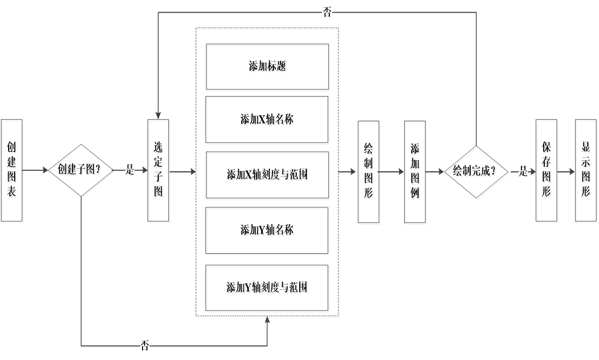

​         Matplotlib提出了Object Container概念，它有Figure、Axes、Axis和Tick四种类型的对象容器。

​          Figure负责图像大小、位置等操作。

​          Axes负责坐标系的位置、绘图等操作。

​          Axis负责坐标轴的操作。

​          Tick负责刻度的相关操作。

​          Figure包含Axes、Axes包含Axis，Axis包含Tick。

## 10.2基于函数的可视化操作

只需要<font color='red'>调用pyplot模块所提供的函数</font>，就可以实现快速绘图及设置图表的各种细节。

```py
#使用pyplot之前首先要导入所在的模块
from matplotlib import pyplot as plt
import matplotlib.pyplot as plt
#将要显示的图片嵌入到Jupyter Notebook中
%matplotlib inline       
```

### 10.2.1. 常用绘图函数

#### 10.2.1.1创建图表和创建子图

 绘图前可以先创建一个空白的图表，并且可以选择是否将整个图表划分为多个子图，以方便在同一幅图上绘制多个图形。当只需要绘制一幅简单的图形时，这部分内容可以省略。

- <font color='red'>figure()</font>

 该函数创建一个图表对象，并且成为当前的Figure对象。也可以不创建Figure对象而直接调用plot()进行绘图，<font color='red'>这时matplotlib会自动创建一个Figure对象。</font>

- <font color='red'>subplot() </font>

​    可以将一个图表划分成多个子图进行绘制，该函数用来设置子图，第1个参数      是行数，第2个参数是列数，第3个参数是子图的编号 

- <font color='red'>subplots()</font>

该函数返回Figure对象和子图对应的Axes对象数组，Axes是可以进行绘图操作     的对象

#### 10.2.1.2添加图表内容

<font color='red'>可以先绘制图形，也可以先添加各种标签。但是添加图例一定要在绘制图形之后。</font>

- <font color='red'>plot()</font>

创建figure对象之后，接下来调用plot()在当前的figure对象中绘图。plot()的前两个参数是表示 X 、Y 轴数据的对象，后面参数是一个格式化字符串，由颜色字符、风格字符和标记字符组成

- title()、text()

在当前图表中添加标题、文本注释信息

- legend()      

设置图例

- xlabel()、ylabel()      

添加X轴和Y轴名称

- xlim()、ylim()     

设置当前图表的X轴和Y轴取值范围

- xticks()、yticks()     

指定X轴和Y轴刻度的数目与取值

#### 10.2.1.3保存与显示图形

- savefig()     

保存绘制的图形到文件中，可以指定图形的分辨率、边缘的颜色等参数

- show()    

显示图形

#### 10.2.1.4一些问题设置(字体)

```py
#matplotlib inline                       
from matplotlib import pyplot as plt	#导入pyplot库
import numpy as np			#导入科学计算库numpy
#设置中文字体
font = {
    'family': "KaiTi",                  		#字库：楷体
    "weight":"bold",                    		#加粗
    "size":16                          		#字号
}
plt.rc("font",**font)       			#设置配置参数
plt.rc("axes",unicode_minus=False)      	#处理负号显示问题

#创建绘图数据
x = np.arange(0.0, 2.0, 0.01)	#x轴数据[0.0,2.0)，间隔0.01
y = 1 + np.sin(2 * np.pi * x)	#y轴数据1+sin(2Πx)
fig = plt.figure(figsize = (20, 8))     	#设置图片宽度20英寸，高度8英寸
plt.plot(x, y,"r--")                    	#绘图参数设置
plt.xlabel("时间/s")                   	#设置x轴标签
plt.ylabel("电压/mv")                   	#设置y轴标签
plt.title("第一个图形示例")             #设置图片的标题
t = [r"$1+ sin(2\pi{x})$"]                 #使用LaTex语法描绘数学公式
plt.legend(t,loc="upper left",frameon=True)	   #设置图例，位置左上，带边框

#savefig()函数保存图表到文件，它的参数可以指定要保存的文件名、分辨率、去除四周空白
plt.savefig(r"d:\test2.png",dpi=1000,bbox_inches='tight',pad_inches=0)        	
plt.show()                             #显示图形
```

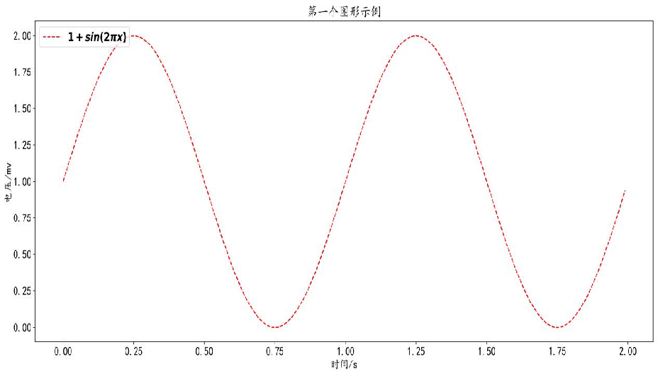

#### 10.2.1.5绘画风格设置use

```py
#科学绘画风格
plt.style.use('science')
```


### 10.2.2绘制多个子图

一个Figure对象可以包含多个子图（Axes），在matplotlib中用Axes对象表示一个绘图区域（子图）。可以用subplot()函数快速绘制包含多个子图的图表。

 <font color='red'>subplot(nrows,ncols,index,**kwargs)</font>

整个绘图区域被等分为nrows行和ncols列，然后按照从左到右、从上到下的顺序对每个区域进行编号，左上区域的编号为1。index参数指定创建Axes对象所在的区域。<font color='red'>如果3个参数的值都小于10，那么就可以把它们缩写成一个整数</font>。如223表示第2行第1列的子图。

```py
plt.figure(1)           				#创建图表1
plt.figure(2)             				#创建图表2
ax1 = plt.subplot(211)    			#在图表2中创建子图1
ax2 = plt.subplot(212)    			#在图表2中创建子图2
x = np.linspace(0,3,100)  			 #生成X轴数据
plt.figure(1) 
for i in range(5):        							
	plt.plot(x,np.exp(i*x/3),label=r"$e^{%dx}$"%i)	 #在图表1中绘图 
	plt.legend()		  			 #显示图例 
	plt.sca(ax1)          				#选择图表2的子图1     
	plt.plot(x,i+x,label=r"%d+x"%i)		#在图表2的子图1中绘图
	plt.legend()
	plt.sca(ax2)          				#选择图表2的子图2
	plt.plot(x,np.cos(i*x),label=r"cos%dx"%i)	#在图表2的子图2中绘图
 	plt.legend()
plt.figure(1)
plt.savefig("d:/test1.png")			#图表1存盘
plt.figure(2)
plt.show()			
```

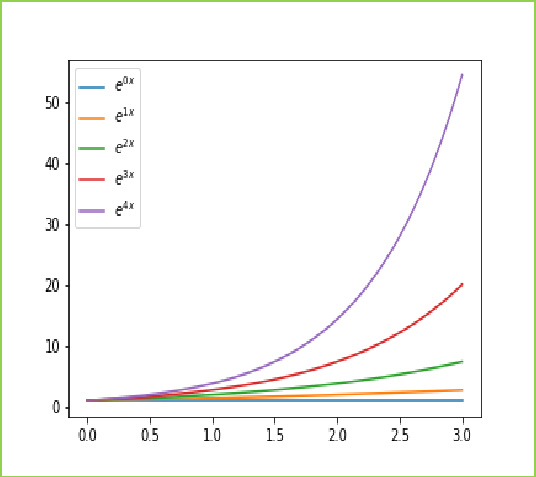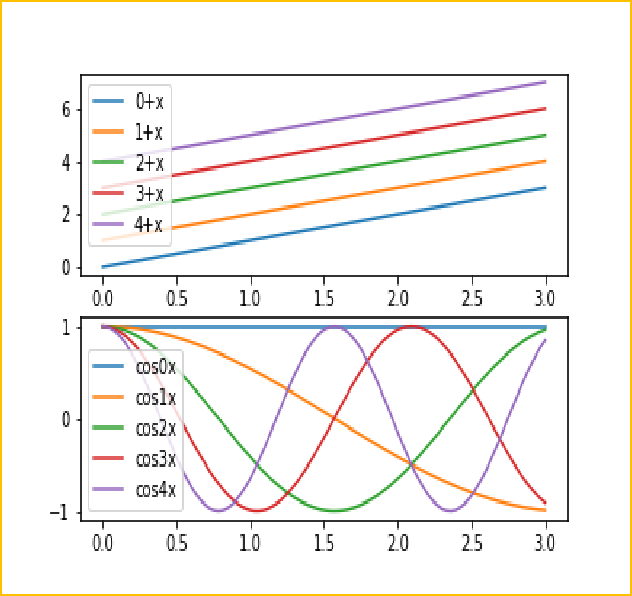

## 10.3基于对象的可视化操作

当前的图表和子图可以通过gcf()和gca()获得，其中gcf()获得表示图表的Figure对象，gca()获得表示子图的Axes对象。

 使用matplotlib绘制的图表每个组成部分都和一个对象对应，可以<font color='red'>通过调用这些对象的属性设置方法`set_*()`或者pyplot模块的属性设置方法setp()</font>来设置它们的属性值，也可以通过属性获取方法<font color='red'>`get_*()`或者pyplot模块的属性获取方法getp()来获取对象的属性，或者直接获取对象的属性。</font>

```py
plt.rcParams["font.family"] = "KaiTi"		#使用楷体字库
plt.rcParams["font.size"] = "16"	              #设置字体大小
x = np.arange(0,5,0.1)				#生成X轴数据
lines = plt.plot(x,x ** 2,x,x**3)  #plot()返回一个元素类型为Line2D的列表
lines[0].set_label(r"$x^2$")			#设置第1个图表的图示x2
lines[0]._color = "r"			#设置第1个图表对象的颜色为红色
lines[0].set_linestyle("--")		#设置第1个图表的线型为虚线
plt.setp(lines[1],color="g",label=r"$x^3$") #设置第2个图表的颜色和图示
plt.setp(lines,linewidth=3.0)		#两个图表线宽统一设置为3
print(lines[1]._label)		#直接获取第2个图表对象的label属性
```

```py
#matplotlib inline
import numpy as np
from matplotlib import pyplot as plt
#X轴和Y轴数据
x = np.linspace(-1.5 * np.pi,2 * np.pi,256,endpoint=True)
y = np.cos(x)
#创建figure对象
fig = plt.figure(figsize=(10,4),dpi=1000)
#figure对象获取axes对象
ax1 = fig.add_subplot(211)
#axes对象绘图
ax1.plot(x,y,color="b",linewidth=2.5,linestyle="-",label="cosine")

#axes对象调整坐标轴
ax1.spines['right'].set_color("none")
ax1.spines['top'].set_color("none")
ax1.spines['bottom'].set_position(('data',0))
ax1.spines['left'].set_position(('data',0))
#axes对象获取axis对象
x_axis = ax1.get_xaxis()
y_axis = ax1.get_yaxis()

#axis对象设置数据轴宽度、修改刻度、刻度标签
x_axis.set_data_interval(x.min() * 1.1 ,x.max() * 1.1)
x_axis.set_ticks([-1.5 * np.pi,-np.pi,-np.pi/2.0,0,np.pi/2.0,np.pi,1.5*np.pi,2*np.pi])
x_axis.set_ticklabels([r"$-3/2\pi$",r"$-\pi$",r"$-\pi/2$",r"$0$",r"$+\pi/2$",r"$+\pi$",r"$+3/2\pi$",r"$+2\pi$"])
y_axis.set_data_interval(y.min() * 1.1 ,y.max() * 1.1)
y_axis.set_ticks([-1,+1])
y_axis.set_ticklabels([r"$-1$",r"$+1$"])

#axis对象设置刻度位置
x_axis.set_ticks_position("bottom")
y_axis.set_ticks_position("left")

#figure对象添加axes对象
ax2 = fig.add_subplot(212)
t = 2 * np.pi / 3
ax2.plot([t,t,0],[0,np.sin(t),0],color="r",linewidth=1.5,linestyle="--",label="axis 2")
ax1.legend(loc="upper left",frameon=False)
ax2.legend(loc="upper left",frameon=False)
fig.show()

```

## 10.4配置文件

matplotlibrc配置文件是一个文本文件，它实际上是一个字典。配置文件的读入可以使用rc_params()函数，它返回一个配置字典。

matplotlib使用rcParams字典中的配置进行绘图，用户可以直接修改此字典中的配置。

## 10.5中文显示

matplotlib默认配置文件中使用的字体无法正确显示中文字符，为了让图表能正确显示中文字符，有3种解决方案：

- <font color='red'>代码中直接指定字体</font>
- <font color='red'>修改配置字典变量rcParams中键对应的值</font>
- <font color='red'>修改配置文件</font>

如果要使用windows中Fonts目录下众多的复合字体文件（*.ttc），可以直接创建字体文件的FontsProperties对象，并使用此对象指定图表中各种文字的字体。

```py
from matplotlib.font_manager import FontProperties 
font = FontProperties(fname=r"c:\windows\fonts\simsun.ttc",size=16)  
```

## 10.6分类图

### 10.6.1绘制对数坐标图

函数主要有3个，分别是：

<font color='red'>semilogx()、semilogy()和loglog()</font>，它们分别绘制X轴、Y轴以及XY轴为对数坐标的图表。

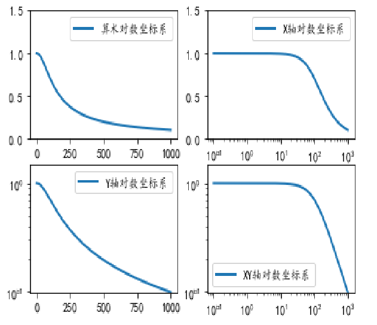

创建极坐标图表可以通过subplot()函数来完成，设置该函数的关键值参数<font color='red'>poplar=True</font>即可。使用<font color='red'>rgrids()函数设置同心圆栅格的半径大小和文字标注角度，使用thetagrids()设置放射线栅格的角度，绘画的范围。</font>

```py
plt.subplot(121,polar=True)		#创建极坐标子图1
plt.plot(theta,theta/6,linewidth=2.0)
plt.plot(3*theta,theta/3,"--",linewidth=2.0)
plt.rgrids(np.arange(0.5,2,0.5),angle=45)	
plt.thetagrids([0,60])
```

### 10.6.2直方图

直方图是为了直观显示数据的分布情况，直方图的横轴表示数据，纵轴表示数据出现的次数。

使用<font color='red'>hist()</font>函数可以绘制直方图，它的第1个参数表示数据，不能省略，其它参数为关键字参数，其中<font color='red'>bins表示直方图的柱子数，alpha表示透明度，histtype设置直方图的类型，color设置颜色,density设置归一化</font>等。

```py
from matplotlib import pyplot as plt
import numpy as np		         #导入科学计算库
data1 = np.random.randn(100000)   #生成100000个(0,1)符合正态分布的样本
data2 = np.random.rand(100000)    #生成100000个(0,1)符合均匀分布的样本
plt.hist(data1,100,alpha=0.7, color='red')
plt.hist(data2,100,alpha=0.4,color='blue')
plt.grid(True, ls='--')				#绘制网格
plt.legend(["Normal","Uniform"])	     		#设置图例
plt.show()
```

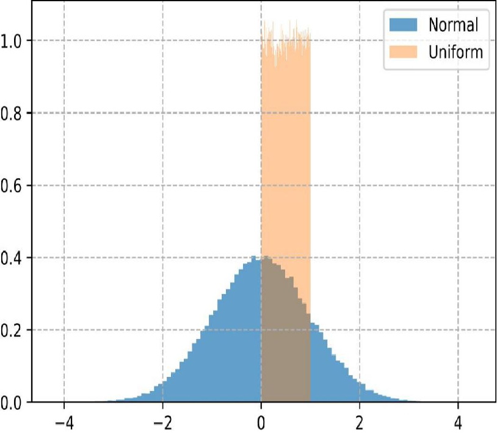

### 10.6.3柱状图

柱状图用每根柱子的长度表示值的大小，它们通常用来比较两组或多组值。<font color='red'>柱状图主要用于查看各分组数据的数量分布，以及各个分组数据之间的数量比较。</font>

<font color='red'>使用bar()函数可以绘制垂直柱状图，它的第1个参数为每根柱子左边缘的横坐标，第2个参数为每根柱子的高度，第三个参数指定所有柱子的宽度，默认是0.8。</font>

<font color='red'>grid()函数用于绘制网格，通过对参数的个性化设置，可以绘制出个性化的网格。</font>

```py
data1 = [107,115,145,212,280,338,350,358,368]
data2 = [190,260,310,380,410,500,510,580,600]   		
years = np.arange(2000,2009,1) 	#创建数组
plt.figure(figsize=(10,6))
plt.bar(years,data2,label="大学录取人数",color="b",width=0.3,alpha=0.3)  
for x,y in zip(years,data2):
      plt.text(x,y,y,ha="center",va="bottom")      
plt.bar(years+0.3,data1,label="大学毕业人数",color="g",width=0.3,alpha=0.6)
plt.grid(color="r",linestyle="--",linewidth=1,axis="y",alpha=0.4)  		
for x,z in zip(years+0.3,data1):
      plt.text(x,z,z,ha="center",va="bottom")   				
plt.xlabel("年度")
plt.ylabel("大学录取/毕业人数（万）")
plt.title("中国大学录取/毕业人数数据（2000年-2008年）")
```

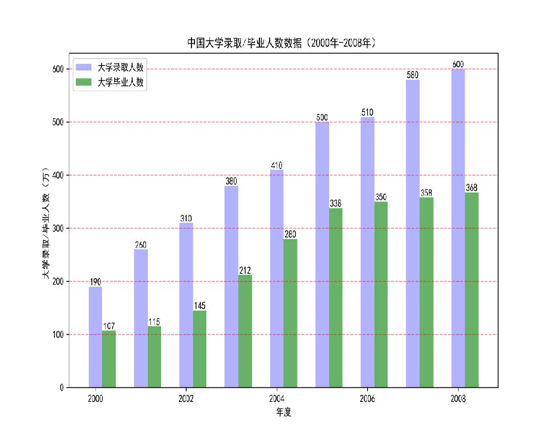

### 10.6.4 饼状图

饼状图是将各项的大小与各项总和的比例显示在一张“饼”上，以“饼”的大小来确定每一项的占比。<font color='red'>饼状图可以比较清楚地反映出部分与部分、部分与整体之间的比例关系，易于显示每组数据相对于总数的大小，而且显示方式比较直观。</font>

<font color='red'> pyplot中绘制饼状图使用函数pie()。</font>

<font color='red'> pie()中参数startangel设置开始角度，autopct设置数值显示方式，radius设置半径，默认为1</font>

```py
fig = plt.figure(figsize=(8,3))
ax1 = fig.add_subplot(1,2,1)   			#定义子图1
plt.sca(ax1)                   				#选择子图1
explode1 = [0, 0, 0, 0,1] # 1是要凸出这的部分
label1 = "2000年","2001年","2002年","2003年","2004年"
plt.pie(data1[0:5],explode=explode1,labels=label1,autopct="%1.1f%%",startangle=45,radius=0.8) 
ax2 = fig.add_subplot(1,2,2)  			#定义子图2
plt.sca(ax2)                  				#选择子图2
explode2 = [0, 0, 0, 0] # 1是要凸出这的部分
label2 = "2005年","2006年","2007年","2008年"
plt.pie(data2[5:9],explode=explode2,labels=label2,autopct="%1.1f%%",startangle=90) 
plt.show()
```

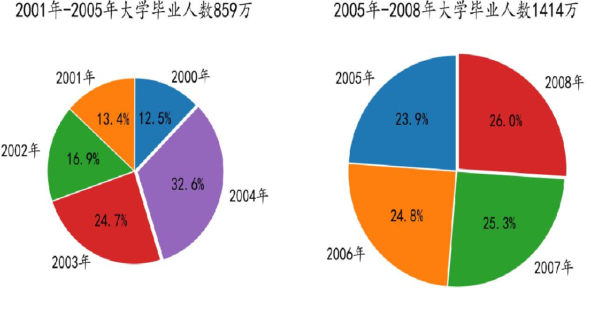

### 10.6.4 散点图

散点图可以用来呈现数据点的分布，<font color='red'>表现两个元素之间的相关性。scatter()函数可以用来绘制散点图</font>，传入X和Y轴坐标数据即可。

```py
x = np.random.random(50)		#产生50个0到1之间的随机数
y = x + np.random.random(50) / 8	#模拟X和Y之间的相关性
plt.scatter(x,y,s = x*300,c='r',marker='*')	
#参数s指定大小，c设置颜色，marker设置形状
plt.show()
```

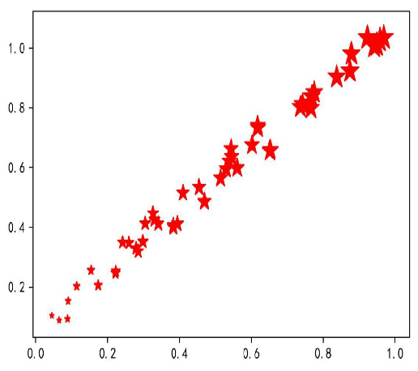

### 10.6.5箱线图

箱线图可以观察<font color='red'>最小值、下四分位数、中位数、上四分位数和最大值</font>，它可以粗略地看出数据是否具有对称性、分布的分散程度等信息，特别是可以对几个样本进行比较。

<font color='red'>pyplot中绘制箱线图的函数是boxplot()。</font>

<font color='red'>boxplot()函数中参数notch设置中间箱体是否有缺口，labels指定箱线图的标签，meanline表示是否显示均值线</font>

```py
data1 = [107,115,145,212,280,338,350,358,368]   
data2 = [900,260,310,380,410,500,510,580,600]
label = ["毕业人数","录取人数"]
plt.boxplot((data1,data2),notch=True,labels=label,meanline=True) 
```

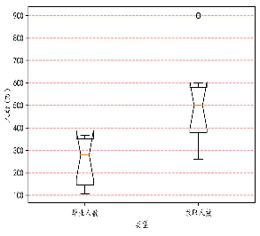

## 10.7seaborn可视化

seaborn预先设计好了5种主题样式：<font color='red'>darkgrid、dark、whitegrid、white和ticks</font>，默认使用darkgrid主题样式。

searborn库的<font color='red'>set()方法可以设置主题、调色板等多个样式。</font>

```py
import seaborn as sns		#导入seaborn扩展库
sns.set(style="whitegrid",palette="muted",color_codes=True)	
#set()中style参数设置主题，palette参数设置调色板，color_codes参数设置颜色代码
```

### 10.7.1散点图

通过seaborn库的<font color='red'>stripplot()函数可以绘制散点图</font>，当散点图中数据较多时，<font color='red'>很多散点会被覆盖，可以通过加入抖动（jitter=True）来解决。</font>

如果要看清每个数据点，可以使用<font color='red'>swarmplot()函数</font>，该函数的参数x和y表示列名，hue参数表示颜色分类

```py
sns.set(style="ticks")
tips = sns.load_dataset("tips")       #使用seaborn自带tips数据集
fig,axes = plt.subplots(1,2,figsize=(8,4))
sns.stripplot(x='day',y="total_bill",ax=axes[0],data=tips,hue="smoker") 
#当数据点多时，出现覆盖情况
sns.swarmplot(x='day',y="total_bill",ax=axes[1],data=tips)#避免出现覆盖情况
sns.despine()                 #去掉边框
```

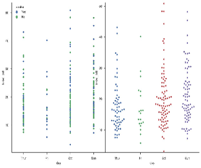

### 10.7.2箱线图

在seaborn中使<font color='red'>用boxplot()函数来绘制箱线图。</font>

```py
sns.set(style="ticks")
tips = sns.load_dataset("tips")                  #使用seaborn自带tips数据集
sns.boxplot(x="day",y="total_bill",hue="smoker",orient="v",palette="Set3",data=tips) 
#参数orient设置朝向，取“v”时沿Y轴方向绘图，取“h”时沿X轴方向绘图
#x、y参数表示要绘制的列，hue参数表示分类变量
sns.despine()
plt.savefig(r"d:\test.png",dpi=1000,bbox_inches='tight',pad_inches=0)
```

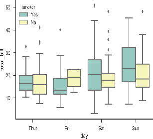

### 10.7.3琴形图

琴形图结合了箱线图与核密度估计图，<font color='red'>在seaborn中，使用violinplot()函数来绘制琴形图。</font>

```py
fig,axes = plt.subplots(1,2,figsize=(13,6))	  #创建多子图，返回fig和axes对象#split参数可以将分类数据进行切分，这样两边的颜色就代表了不同的类别
sns.violinplot(x="day",y="total_bill",hue="sex",data=tips,split=True,ax=axes[0])   #hue参数指定分类依据，inner参数对每个数据进行可视化
sns.violinplot(x="day",y="total_bill",hue="sex",data=tips,inner="stick",ax=axes[1])#琴形图可以和分类函数相互结合，实现更加强大的可视化效果
sns.swarmplot(x="day",y="total_bill",data=tips,color="R",alpha=.6,ax=axes[0])
```

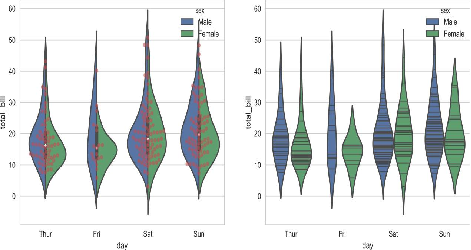

### 10.7.4柱状图

seaborn中使用<font color='red'>barplot()函数来绘制柱状图</font>，默认情况下使用该函数绘制的y轴是变量分布的平均值，并且在每个柱状条上绘制误差线。

```py
sns.barplot(x="day",y="tip",hue="sex",data=tips)
```

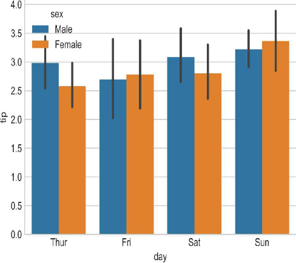

### 10.7.5计数图

柱状图中，常常绘制类别的计数柱状图。在seaborn中，使用<font color='red'>countplot()函数就可以完成。</font>

```py
sns.countplot(x="day",data=tips,palette="Set2")
```

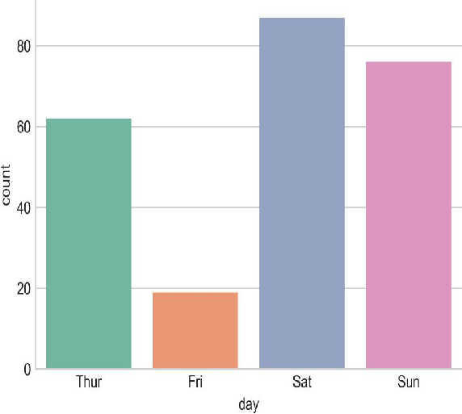

### 10.7.6分组关系图

seaborn中，使用<font color='red'>factorplot()函数</font>完成分组统计功能。

```py
sns.factorplot(x="size",col="sex",data=tips,col_wrap=2,kind="count",size=4,aspect=.9)
#参数col指定分组依据，参数col_wrap指定每行最多平铺数，kind指定绘图类型，size参数指定每个面的高度，aspect参数指定纵横比，每个面的宽度由size×aspect共同确定。
```

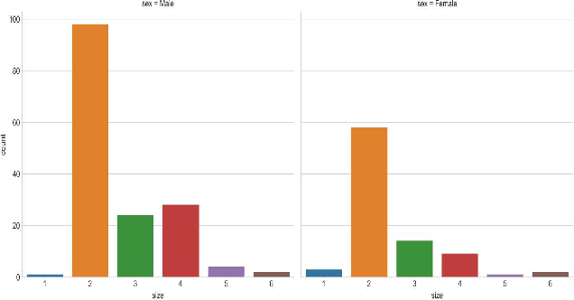

### 10.7.7单变量分布图

单变量分布图的绘制使用seaborn中的<font color='red'>distplot()函数，默认情况下绘制一个直方图，并嵌套一个与之对应的密度图。</font>

```py
fig,axes = plt.subplots(2,2,figsize=(10,6))          #多子图方式绘图
sns.distplot(tips["tip"],ax=axes[0][0])	#默认方式绘制一个直方图和密度图
sns.distplot(tips["tip"],kde=False,ax=axes[0][1])#kde为False时不绘制密度图
sns.distplot(tips["tip"],hist=False,ax=axes[1][0])#hist为False时不绘制直方图
sns.distplot(tips["tip"],rug=True,ax=axes[1][1])#rug为True时为每个样本点添加小细线
```

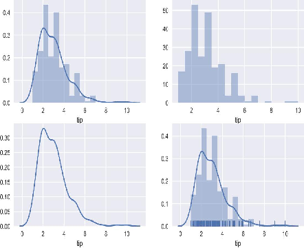

### 10.7.8多变量分布图

为了绘制<font color='red'>两个变量</font>的分布关系，常常使用散点图的方法。在seaborn中，<font color='red'>使用jointplot()函数绘制一个多面板图，不仅可以显示两个变量的关系，还可以显示每个单变量的分布关系。</font>

```py
sns.jointplot(x="tip",y="total_bill",data=tips,kind="reg",color="b")
#参数x、y表示数据集中的列名，只能是数字。
#参数data表示数据集，参数kind表示分类图的类型
#kind取kde表示密度图，kind取reg表示回归图，kind默认取scatter表示点散图
```

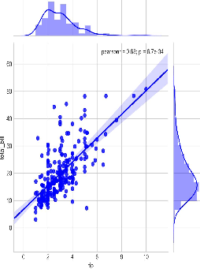

在数据集中，如果要体现<font color='red'>多个变量</font>的分布情况，就需要成对的二元分布图。在seaborn中，可以使用<font color='red'>pairplot()函数来完成二元分布图</font>，该函数会创建一个轴矩阵，以此显示每两列的关系，在主对角线上为单变量的分布情况。

pairplot()<font color='red'>只对数值型的列有效</font>，其中参数diag_kind表示对角线子图的类型，可以取hist和kde，分别表示直方图和密度图，默认对角线为直方图；参数hue指定分类变量；参数kind指定非对角线子图类型，默认为散点图，取reg时为回归图，取scatter时为散点图。

```py
sns.pairplot(tips, diag_kind="hist",hue="sex")
```

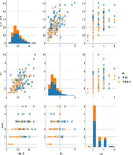

### 10.7.9热力图

利用热力图可以查看数据集中多个特征之间两两相关性的强弱。seaborn中<font color='red'>heatmap()</font>函数提供了热力图的绘制功能。

```py
#sns.set(font='SimHei') 			#设置中文字体
sns.heatmap(tips.corr(), xticklabels=True,   
yticklabels=True,cmap='rainbow',annot=True, square=True)
#tips.corr()计算tips数据集中每两列之间的相关性，xticklabels参数为True时，绘制列名，annot参数决定是否在网格中写入数字，square参数设置网格是否为正方形，cmap参数是colormap对象名或者颜色名称，fnt参数指定网格中数据的显示格式
```

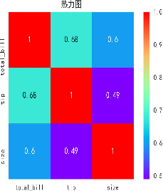

### 10.7.10回归图

 回归图，来揭示两个变量之间的线性关系。

seaborn中使用<font color='red'>regplot()和lmplot()函数</font>来绘制回归图，其绘制的图表是一样的，但是两者传入的参数略有不同。

```py
sns.lmplot("total_bill","tip",hue="smoker",markers=["x","o"],data=tips)
#使用hue参数可以加入一个分类变量，通过不同颜色来表示
```

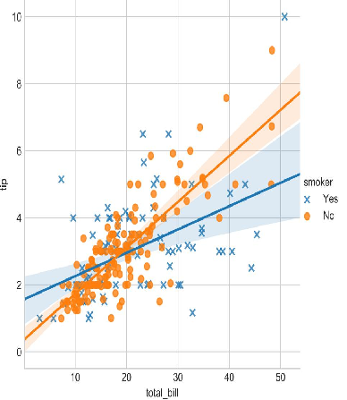

#  第十一章  Numpy基础与实战

## 11.1多维数组对象ndarray

Numpy提供了两种基本的对象：

- <font color='red'>ndarray</font>: 英文全称为n-dimensional array object，称为多维数组，后统一称之为数组。
- <font color='red'>ufunc</font>: 英文全称为universal function object，它是一种能够对数组进行处理的特殊函数。
- Numpy库的核心对象是n维数组对象ndarray，Python中所有的函数都是围绕ndarray对象进行的。ndarray数组能够对整块数据进行数学运算，通常来说，<font color='red'>ndarray是存储单一数据的容器，即其中的所有元素都需要是相同的类型，和list不同，它能直接保存数据，而list保存的是对象的引用。</font>

### 11.1.1创建ndarray对象

#### 11.1.1.1数组的属性

| 属性     | 含义                                                        |
| -------- | ----------------------------------------------------------- |
| ndim     | 数组的维度                                                  |
| shape    | 数组的维度大小，返回元组。对于n行m列的数组，维度大小为(n,m) |
| size     | 数组中元素的总数，等于行数乘以列数                          |
| dtype    | 数组的元素类型                                              |
| itemsize | 数组的每个元素的大小（以字节为单位）                        |
| data     | 生成指向数组首地址的一个memoryview对象                      |

#### 11.1.1.2数组的创建

创建数组最简单的方法就是使用Numpy提供的<font color='red'>array()函数，通过给array()函数传递序列对象来创建数组</font>，如果传递的是<font color='red'>多层嵌套的序列，则创建多维数据</font>    

在创建数组时，numpy会为新建的数组<font color='red'>推断出一个合适的数据类型</font>，并保存在dtype属性中。

```py
import numpy as np
data1 = [1,2,3,4]
arr1 = np.array(data1)
arr1
#array([ 1.,  2.,  3.,  4.])

data2 = [[1,2,3],[4,5,6]]
arr2 = np.array(data2)
arr2
#array([[1, 2, 3],      [4, 5, 6]])
arr2.ndim
#2
arr2.shape
#(2,3)
arr2.size
#6
arr2.dtype
#dtype('int32')
```

### 11.1.2变换数组的形状

在对数组进行操作时，经常要改变数组的维度。可以通过修改数组的<font color='red'>shape 属性</font>，在保持数组元素个数不变的情况下，改变数组每个轴的长度。

```py
arr2.shape = (3,2)
arr2
#array([[1, 2],      [3, 4],      [5, 6]])

arr2.shape = (1,-1)
arr2
#array([[1, 2, 3, 4, 5, 6]])

arr4 = arr2.ravel()
arr4
#array([10,  2,  3,  4,  5,  6])

arr5 = arr2.flatten()
arr5.shape
#(6,)
```

### 11.1.3数组的组合和分割

除了可以改变数组“形状”外，numpy也可以对数组进行组合。组合主要有横向与纵向组合。可以使用<font color='red'>hstack()、vstack()以及concatenate()来完成数组的组合</font>。

横向组合是将ndarry对象构成的元组作为参数，传给hstack()函数。

纵向组合同样是将ndarray对象构成的元组作为参数，传给vstack()函数。

concatenate()函数也可以实现数组的横向组合和纵向组合，其中参数axis=1时按照横向组合，axis=0时按照纵向组合。

```py
a = np.array(([1],[2],[3]))
b = np.array([[4],[5],[6]])
np.hstack((a,b))
#array([[1, 4],       [2, 5],       [3, 6]])

np.vstack((a,b))
#array([[1],       [2],       [3],       [4],       [5],       [6]])
```

<font color='red'>hsplit()按照横向分割数组，vsplit()按照纵向分割数据，split()可以指定分割轴向，dsplit()要求数组的维度是3及以上。</font>

```py
a = np.arange(16).reshape(4,4)
np.hsplit(a,2)
#[array([[ 0,  1],        [ 4,  5],        [ 8,  9],        [12, 13]]), 
#array([[ 2,  3],        [ 6,  7],        [10, 11],        [14, 15]])]

np.split(a,[2,3],axis = 0)     #按照纵向分割，分隔位置第2行、第3行
#[array([[0, 1, 2, 3],        [4, 5, 6, 7]]), array([[ 8,  9, 10, 11]]), array([[12, 13, 14, 15]])]

```

### 11.1.4自动生成数组

arange()类似于内置函数range()，通过<font color='red'>指定开始值、终值和步长</font>来创建表示<font color='red'>等差数列的一维数组</font>，注意所得到的结果中不包含终值。

```py
np.arange(10)
#array([0, 1, 2, 3, 4, 5, 6, 7, 8, 9])

np.arange(1,13,2)
#array([ 1,  3,  5,  7,  9, 11])

```

<font color='red'>linspace()通过指定幵始值、终值和元素个数来创建表示等差数列的一维数组，可以通过 endpoint参数指定是否包含终值，默认值为True，即包含终值。</font>

```py
np.linspace(1,10,10)
#array([  1.,   2.,   3.,   4.,   5.,   6.,   7.,   8.,   9.,  10.])

np.linspace(1,10,10,endpoint = False)
#array([ 1. ,  1.9,  2.8,  3.7,  4.6,  5.5,  6.4,  7.3,  8.2,  9.1])

```

<font color='red'>logspace()和linspace()类似，通过指定开始指数、结束指数和元素个数来创建表示等比数列的一维数组，可以通过指定base参数来确定底数，默认为10，还可以通过endpoint参数确定是否包括结束指数，默认为True，表示包含。</font>

```py
np.logspace(0,3,4)
#array([ 1.,  10.,  100., 1000.])

np.logspace(0,3,4,base = 2)
#array([ 1.,  2.,  4.,  8.])

```

zeros()、ones()、empty()可以创建指定形状和类型的数组。其中<font color='red'>empty()只分配数组所使用的内存，当并不对数组元素进行初始化操作</font>，因此它的运行速度是最快的。<font color='red'>zeros()将数组元素初始化为0, ones()将数组元素初始化为1。eye()用来生成主对角线上的元素为1，其它元素为0的数组，diag()创建类似对角的数组，主对角线上的元素可以指定。</font>

### 11.1.5随机数函数

| 函数          | 含义                                        |
| ------------- | ------------------------------------------- |
| random()      | 生成[0,1)之间指定数目的随机数组成的一维数组 |
| rand()        | 生成服从均匀分布的样本值                    |
| randn()       | 生成服从正态分布的样本值                    |
| randint()     | 生成指定上下限范围的随机数                  |
| seed()        | 确定随机数生成器的种子                      |
| permutation() | 对一个序列进行随机排序，不改变原数组        |
| shuffle       | 对一个序列进行随机排序，改变原数组          |
| binomial()    | 产生二项分布的随机数                        |
| normal()      | 产生正态（高斯）分布的随机数                |
| beta()        | 产生beta分布的随机数                        |
| uniform()     | 产生均匀分布的数组                          |

### 11.1.6数组索引和切片

#### 11.1.6.1一维数组的索引和切片

通过切片获取的新的数组是原始数组的一个视图，<font color='red'>它与原始数组共享同一块数椐存储空间，这就意味着在视图上的操作都会使得原始数组发生改变。</font>

<font color='red'>如果需要的并非视图而是要复制数据，则可以通过copy()方法来实现，这时新旧两个数组不共享同一块数据存储空间。</font>

```py
arr4[0:2] = 10,11
arr4
#array([10, 11,  3,  4,  5,  6,  7,  8,  9])

arr5 = arr4[2:4]
arr5
#array([3, 4])

arr5[:] = 0
arr5
#array([0, 0])

arr4
#array([10, 11,  0,  0,  5,  6,  7,  8,  9]

```

#### 11.1.6.2二维数组的索引与切片

当使用<font color='red'>整数列表</font>对数组元素进行存取时，<font color='red'>将使用列表中的每个元素作为下标，这种索引称为“花式索引”。</font>

<font color='red'>注意：使用列表作为下标得到的数组不和原始数组共享数据。</font>

```py
arr = np.arange(32).reshape((8, 4))
arr
#array([[ 0,  1,  2,  3],       [ 4,  5,  6,  7],       [ 8,  9, 10, 11],       [12, 13, 14, 15],       [16, 17, 18, 19],       [20, 21, 22, 23],       [24, 25, 26, 27],       [28, 29, 30, 31]])

arr[[1, 5, 7, 2], [0, 3, 1, 2]]   #花式索引
#array([ 4, 23, 29, 10])

arr[[1, 5, 7, 2]][:, [0, 3, 1, 2]]  ：表示一一对应
#array([[ 4,  7,  5,  6],       [20, 23, 21, 22],       [28, 31, 29, 30],       [ 8, 11,  9, 10]])

```

## 11.2创建numpy矩阵对象

### 11.2.1创建numpy矩阵

- 使用mat()函数

- 使用matrix()函数

```py
matr1 = np.mat("1,2,3;4,5,6;7,8,9",dtype = np.float64)

matr2 = np.matrix([[1,2,3],[4,5,6],[7,8,9]])
matr2
#matrix([[ 1.,  2.,  3.],        [ 4.,  5.,  6.],        [ 7.,  8.,  9.]])

```

### 11.2.2矩阵运算

<font color='red'>矩阵运算是针对整个矩阵中的每个元素进行的，和使用循环相比，在运算速度上更快。</font>

<font color='red'>矩阵和矩阵之间可以进行+、-、`*`、/，其中*为点乘，需要特别注意。如果要对应元素相乘可以使用multiply()函数。</font>

| 属性 | 含义               |
| ---- | ------------------ |
| T    | 返回矩阵的转置     |
| H    | 返回矩阵的共轭转置 |
| I    | 返回逆矩阵         |
| A    | 返回矩阵的视图     |

### 11.2.3通用函数

通用函数（ufunc）是一种<font color='red'>对数组中每个元素</font>进行操作的函数，用法也很简单。

通用函数<font color='red'>支持全部的四则运算（+、-、*、/、**）</font>，并且保留习惯的运算符，但是需要注意，操作的对象是数组。数组间的四则运算表示对每个数组中的元素分别进行四则运算，所以<font color='red'>进行四则运算的两个数组的形状必须一致</font>。

 通用函数也支持<font color='red'>比较运算（>、>=、<、<=、==、!=、all、any）</font>，返回结果是一个<font color='red'>布尔数组</font>，<font color='red'>(其每个元素对应元素的比较结果</font>)。

```py
a = np.arange(1,10,1).reshape(3,3)
b = np.arange(10,19,1).reshape(3,3)
b - a
#array([[9, 9, 9],       [9, 9, 9],       [9, 9, 9]])

b / a 
#array([[ 10. ,   5.5,   4. ],       [  3.25      ,   2.8  ,   2.5       ],       [  2.28571429,   2.125     ,   2.        ]])

a[0] = 20
a >= b
#array([[ True,  True,  True],       [False, False, False],       [False, False, False]], dtype=bool)

(a >= b).all()                   #与运算
#False
```

### 11.2.4统计运算

Numpy库支持对整个数组或者按照指定轴向的数据进行统计计算,<font color='red'>当axis参数为0时，表示沿着纵轴计算，当axis为1时，表示沿着横轴进行计算。</font>

```py
arr = np.random.randint(1,10,(3,3))
arr
#array([[4, 9, 3],       [1, 9, 7],       [1, 6, 1]])

arr.sort()
arr
#array([[3, 4, 9],       [1, 7, 9],       [1, 1, 6]])
```

| 方法           | 含义                 | 方法    | 含义                                 |
| -------------- | -------------------- | ------- | ------------------------------------ |
| sum            | 求和                 | unique  | 找出数组中的唯一值并返回已排序的结果 |
| mean           | 算术平均值           | tile    | 把一个数组重复若干次                 |
| std、var       | 标准差和方差         | repeat  | 按照轴向重复一个数组若干次           |
| min、max       | 最小值和最大值       | cumprod | 所有元素的累计积                     |
| argmin、argmax | 最小值和最大值的索引 | sort    | 排序                                 |
| cumsun         | 所有元素的累计和     |         |                                      |

## 11.3数组的存取

- <font color='red'>save()</font>函数将一个数组以二进制的格式保存，系统自动添加文件扩展名为“.npy”
- <font color='red'>savez()</font>将多个数组保存到一个二进制文件中，文件扩展名为“.npz”
- <font color='red'>savetxt()</font>函数将数组写到以某个分隔符隔开的文本文件中
- <font color='red'>load()</font>函数读取二进制文件，读取时不能省略扩展名
- <font color='red'>loadtxt()</font>把一个文本文件加载到一个二维数组中。

```py
arr = np.arange(16).reshape(4,4)
np.save("./data/save_arr",arr)
datas = np.load("./data/save_arr.npy")datas
#array([[ 0,  1,  2,  3],       [ 4,  5,  6,  7],       [ 8,  9, 10, 11],       [12, 13, 14, 15]])

np.savetxt("./data/arr.csv",arr,fmt="%d",delimiter=":")
f = open("./data/arr.csv","rt")               #打开文件
f.readlines()                              #读取文件内容
#['0:1:2:3\n', '4:5:6:7\n', '8:9:10:11\n', '12:13:14:15\n']

datas = np.loadtxt("./data/arr.csv",delimiter=":")
datas
#array([[  0.,   1.,   2.,   3.],       [  4.,   5.,   6.,   7.],       [  8.,   9.,  10.,  11.],       [ 12.,  13.,  14.,  15.]])

```

#  第十二章  Pandas基础与实战

## 12.1pandas数据结构

### 12.1.1Series（序列）

Series类似于一维数组，由一组<font color='red'>数据</font>（可以是任意的Numpy数据类型）和一组称之为<font color='red'>数据标签的索引</font>组成。

#### 12.1.1.1Series对象的创建

- ##### 通过一组列表数据产生

```py
from pandas import Series       #导入pandas库中Series模块
pds1 =  Series([1, 2, 3, 4])
pds1

0    1
1    2
2    3
3    4
dtype: int64
```

- ##### 通过指定索引的方式

```py
pds2 = Series([1, 2, 3, 4], index=['a', 'b', 'c', 'd'])
pds2

a    1
b    2
c    3
d    4
dtype: int64
```

- ##### 通过字典方式创建

```py
data = {"i1":1,"i2":2,"i3":3,"i4":4}
#由于字典是无序的，因此指定索引排列顺序
ps3 = Series(data,index=['i1','i2','i3','i4'])      
ps3

i1    1
i2    2
i3    3
i4    4
dtype: int64
```

#### 12.1.1.2DataFrame（数据框）

DataFrame是一种类似于关系表的表格型数据结构，DataFrame对象是一个<font color='red'>二维表格</font>,其中，<font color='red'>每列中的元素类型必须一致，而不同的列可以拥有不同的元素类型</font>。它是数据科学中最为广泛使用的数据结构之一。

<font color='red'>建DataFrame的方法有很多，最常用的是传入二维数组、由数组、Series、列表或者元组组成的字典给DataFrame()。</font>

```py
data = {    "name":["王晓明","李静","田海"],    "sex":["男","女","男"],    "aged":[20,19,21]}
#字典是无序的，因此需要通过columns指定列索引的排列顺序
df = DataFrame(data,columns=["name","sex","aged"]) 
df
```

DataFrame数据有<font color='red'>列索引和行索引</font>，行索引类似于关系表中每行的编号（未指定行索引的情况下，会使用0到N-1作为行索引），列索引类似于表格的列名（也称为字段）。

```py
df1 = DataFrame(data,columns = ["name","sex","aged"],index = ["L1","L2","L3"])
df1

```

## 12.2pandas的索引操作

### 12.2.1重新索引

<font color='red'>重新索引就是对索引进行重新排序</font>，而索引对象是无法修改的。

#### 12.2.1.1Series对象的重新索引

通过Series的<font color='red'>reindex()方法可以调整index的次序</font>，但不是定义一个全新的index，也就是说调整后的index必须为已经存在的index，只是改变了原有index顺序而已，否则自动增加index，对应的元素值为NaN（not a number）缺失值。

我们可以通过Series对象的isnull()方法或者notnull()方法来寻找缺失值。        

注意：<font color='red'>使用reindex()方法不改变原来对象。</font>

```py
import numpy as np
obj = Series([10,20,30,40,-10],index = ["a","b","c","d","e"],dtype=np.float64)
obj

a    10.0
b    20.0
c    30.0
d    40.0
e   -10.0
dtype: float64

obj1 = obj.reindex(index = ["b","c","a","d","e","n"])    #使用reindex方法调整index顺序obj1

b    20.0
c    30.0
a    10.0
d    40.0
e   -10.0
n     NaN         #原来对象并不存在“n”这个索引，pandas自动添加一个缺失值
dtype: float64
```

#### 12.2.1.2DataFrame对象的重新索引

```py
df = DataFrame(np.arange(9).reshape(3,3),index = ["L1","L2","L3"],columns = ["id1","id2","id3"])
#对df重新索引，新增的L4行标签对应的缺失值通过fill_value参数指定为9
df2 = df.reindex(index = ["L1","L2","L3","L4"],columns = ["id3","id2","id1"],fill_value = 9)df2
```

### 12.2.2更换索引

有时我们希望将列数据作为行索引，这时可以通过<font color='red'>set_index()方法来更换索引，生成一个新的DataFrame，原来DataFrame不会发生变换。</font>

与set_index()方法相反的方法是reset_index()。

```py
data = {"name":("张三","李四","王五","赵六"),"sex":("男","女","女","男"),    "aged":(20,19,20,21),"score":(80,60,70,90)}
df = DataFrame(data)                       #使用字典创建DataFrame对象
df

df1 = df.set_index("name")                 #使用name列更换默认行索引
df1
```

## 12.3数据选择

### 12.3.1索引和切片

#### 12.3.1.1Series对象的索引和切片

每个Series对象有两个特殊的属性：

- index：由ndarray数组继承的Index索引对象，保存标签信息。

- values：保存元素值的ndarry数组，numpy的函数都对此数组进行处理。

```py
pds2 = Series([1, 2, 3, 4], index=['a', 'b', 'c', 'd'])
print("Index索引对象: ",pds2.index)
print("值数组：",pds2.values)
#Index索引对象: Index(['a', 'b', 'c', 'd'], dtype='object')
#值数组：[1, 2, 3, 4]
```

Series对象中元素的索引支持<font color='red'>位置下标和标签下标</font>两种形式。

```py
print("使用位置下标方式索引元素pds2[2]: ",pds[2])
print("使用标签下标方式索引元素pds2['b']: ",pds2['b'])
#使用下标方式索引元素pds2[2]:  3
#使用标签方式索引元素pds2['b']:  2
```

Series对象还支持<font color='red'>位置切片和标签切片</font>。<font color='red'>位置切片遵循Python的切片规则</font>，包括起始位置，但不包括结束位置；但<font color='red'>标签切片则同时包括起始标签和结束标签。</font>

```py
print("使用位置切片来索引元素pds2[0:2]",pds2[0:2])
print("使用标签切片来索引元素pds2['a':'c']",pds2['a':'c'])

使用位置切片来索引元素pds2[0:2] a    1
b    2  dtype: int64
使用标签切片来索引元素pds2['a':'c'] a    1
b    2
c    3
dtype: int64
```

#### 12.3.1.2DataFrame索引和切片

DataFrame有两个索引对象：索引行标签的index和索引列标签的columns。使用索引对象的values()方法可以获取对应标签的数组对象，这些对象可以供numpy使用。

##### 12.3.1.2.1选取列

 通过<font color='red'>列索引标签或者以属性的方式</font>可以单独获取DataFrame的列数据，返回的数据为<font color='red'>Series结构</font>，通过标签列表可以获取多个列的数据。

```py
df["name"]    #选取name列，也可以使用df.name，返回一个Series对象,等价于df.name
0    张三
1    李四
2    王五
3    赵六
Name: name, dtype: object

df[["name","sex"]]            #选取name、sex列，返回一个DataFrame对象
```

##### 12.3.1.2.2选取行

通过<font color='red'>行索引标签或者行索引位置（0到N-1）的切片形式可以选取行数据。</font>

位置切片遵循Python的切片规则，包括起始位置，但不包括结束位置。      标签切片则同时包括起始标签和结束标签。      

两种形式的切片返回结果都为DataFrame的子集。

```py
df1[0:2]
df1["张三":"王五"]
```

切片方法选取行只能是<font color='red'>选取连续的行</font>，有很大的局限性。<font color='red'>如果要选取单独的几行，可以通过loc属性和iloc属性来实现。loc属性是按照行索引标签选取数据，iloc属性是按照行索引位置选取数据。</font>

```py
df1.iloc[[0,2]]                             #按照行索引位置选取数据
df1.loc[["张三","王五"]]            #按照行索引标签选取数据
```

##### 12.3.1.2.3选取行和列

<font color='red'>通过iloc属性可以完成，该属性同时支持索引标签和索引位置来进行数据选取。</font>

```py
df1.iloc[[0,3],0:3]                    #选取行索引是0、3，列索引是0、1、2的数据
```

##### 12.3.1.2.4布尔选择

当要选取列中<font color='red'>具体数据</font>时，需要通过布尔选择来完成。

```py
df1["sex"] == "女"
df1[df1["sex"] == "女"]
df1[(df1["sex"] == "女") & (df1["score"] > 60)]
```

### 12.3.2操作行和列

#### 12.3.2.1增加行(append()函数)

增加行数据可以通过<font color='red'>append()函数</font>传入字典数据即可。

```py
append_data = {
    "name":"朱八",
    "sex":"男",
    "aged":23,
    "score":65
}
new_df = df.append(append_data,ignore_index = True)
new_df
```

#### 12.3.2.2增加列

增加列可以直接<font color='red'>通过标签索引方式进行</font>，当新增的列中的数值不一样时，可以传入列表或者数组结构进行赋值。

```py
new_df["city"] = ["北京","西安","长春","珠海","昆明"]
new_df
```

#### 12.3.2.3删除

使用<font color='red'>drop()函数可以删除指定轴上的信息</font>，原来的DataFrame数据不会删除。

```py
new_df.drop(2)                           #删除行索引是2的信息
```

#### 12.3.2.4修改标签

通过<font color='red'>rename()函数完成行和列索引标签的修改，index参数指定要修改的行标签，columns参数指定要修改的列标签。</font>

```py
new_df.rename(index = {3:2,4:3},columns = {"score":"grade"}) #以字典形式指定修改信息
```

## 12.4数据运算

### 12.4.1算术运算

pandas数据对象在进行算术运算时，如果有相同索引对，则进行算术运算；如果没有，则会引入NaN缺失值，这就是数据对齐。       

规则1：数据框DataFrame之间的计算规则---<font color='red'>先补齐标签索引</font>（新增索引对应值为NaN），得到相同结构后，再进行计算。      

规则2：用算术运算符+、-、*、/等会产生NaN值，如果要将<font color='red'>默认填充的NaN改为指定值，建议不要使用算术运算符，而改用成员方法，如add()、sub()、mul()、div()。        </font>

规则3：<font color='red'>数据框DataFrame与数列Series的计算规则---按行广播（axis=1）</font>，先把行改为等长，行内不做循环补齐，只是一行一行计算，不会跨行广播。  

### 12.4.2函数应用和映射

在数据分析时，常常会对数据进行较复杂的数据运算，这时需要定义函数。定义好的函数可以应用到pandas数据中，其中有3种方法：

- <font color='red'>map()函数，将函数应用到Series的每个元素中</font>
- <font color='red'>apply() 函数，将函数应用到DataFrame的行与列上</font>
- <font color='red'>applymap()函数，将函数应用到DataFrame的每个元素上</font>

```py
data = { "name":["张三","李四","王五"],    "length":["172cm","175cm","168cm"]}
df = DataFrame(data)
def f(s):
    return s.split("cm")[0]
df["length"] = df["length"].map(f)  #在length列（Series对象）上的每个元素应用map函数
df

df1 = pd.DataFrame(np.random.rand(3,3),columns=["a","b","c"])
df1
f = lambda x:x.mean()               #定义lambda表达式，求均值
df1.apply(f,axis = 0)                 #沿列方向应用f，求每列的均值
```

### 12.4.3排序

在Series中，通过<font color='red'>sort_index()方法对索引进行排序</font>，默认为升序；通过<font color='red'>sort_values()方法对值进行排序</font>，默认是升序。

```py
obj = Series(range(4), index=['d', 'a', 'b', 'c'])
obj
d    0
a    1
b    2
c    3
dtype: int32

obj.sort_index()
a    1
b    2
c    3
d    0
dtype: int32
```

对于<font color='red'>DataFrame数据而言，通过指定轴方向，使用sort_index()方法可以对行或者列索引进行排序。要根据列进行排序，可以通过sort_values()方法，把列名传给by参数即可。</font>

```py
frame = DataFrame(np.arange(8).reshape((2, 4)), index=['two', 'one'],columns=['d', 'a', 'b', 'c'])
frame.sort_index()                  #默认axis=0，按照纵轴行索引升序排列
```

### 12.4.4统计信息

在DataFrame数据中，通过sum()方法可以对每列进行求和和汇总，还可以指定要汇总的轴方向，方法返回一个Series对象。

```py
df = DataFrame([[1.4, np.nan], [7.1, -4.5],[np.nan, np.nan], [0.75, -1.3]],index=['a', 'b', 'c', 'd'], columns=['one', 'two'])
df.sum()    #默认axis=0，按照纵轴求和
one    9.25
two   -5.80
dtype: float64

df.sum(axis = 1)    #axis=1，按照横轴求和
a    1.40
b    2.60
c    0.00
d   -0.55
dtype: float64
```

describe()方法可以对每个数值型列进行描述性统计，形成统计报告。

```py
df.describe()
```

### 12.4.5唯一值和值计数

通过Series对象的<font color='red'>unique()方法可以获取不重复的数据，而通过Series对象的values_counts()方法可以统计每个值出现的次数。</font>

```py
df= DataFrame({'Va1': [1, 3, 4, 3, 4],'Va2': [2, 3, 1, 2, 3],'Va3': [1, 5, 2, 4, 4]})
df["Va1"].value_counts()
4    2
3    2
1    1
Name: Va1, dtype: int64

df["Va3"].unique()
array([1, 5, 2, 4], dtype=int64)
```

## 12.5数据清洗

数据清洗包括<font color='red'>缺失值处理、重复数据的处理和替代值处理</font>等具体操作。

### 12.5.1处理缺失值

在大多数的数据分析应用程序中，缺少数据是常见的，<font color='red'>缺少的值被pandas标注为np.nan也就是缺失值NaN。</font>

| 方法名    | 含义                                          |
| --------- | --------------------------------------------- |
| isnull()  | 判断每个元素是否为空/缺失值，返回一个布尔数组 |
| notnull() | 判断每个元素是否为非空，返回一个布尔数组      |
| fillna()  | 设置缺失值的填补方法，返回一个新的对象        |
| dropna()  | 删除缺失值                                    |

```py
NA = np.nan
A = DataFrame([[1, 2, 3.], [4, 5, NA], [6, NA, 7]],columns=list("abc"),index=list("123"))
A.isnull()                     #为True的就是缺失值
```

使用<font color='red'>fillna()方法可以对缺失值进行填补，参数value设置填补值，method参数设置填补方式，“ffill”使用前面值填补，“bfill”使用后面值填补。</font>

使用<font color='red'>dropna()方法可以对缺失值进行删除</font>，可以定义删除方式，当how参数为“any”时，删除任何包含NaN的行或列，当how为“all”时，删除所有数据为NaN的行或列。

### 12.5.2异常重复数据

在DataFrame中，<font color='red'>通过duplicated()方法判断各行是否存在重复数据。</font>

```py
data = {
    "id":[1,2,3,1,4],"name":["apple","pear","banana","apple","peach"],  "price":[5,4,3,5,3]
}
df = DataFrame(data)
df.duplicated()                          #判断重复行
0    False
1    False
2    False
3     True
4    False
dtype: bool
```

当发现重复数据时，通过方法<font color='red'>drop_duplicates()删除</font>，该方法默认删除完全重复的行， 只保留第一次出现的数据。也可以指定部分列作为判断重复项的依据。

```py
print(df.drop_duplicates())                   #通过行判断重复
#通过列索引“name”和“price”来判断重复，保留最后一次出现的重复数据
print("-"*20,"\n",df.drop_duplicates(["name","price"],keep="last")) 
#通过列索引“price”来判断重复，保留首次出现的重复数据
print("-"*20,"\n",df.drop_duplicates(["price"]))
```

### 12.5.3替换值  

在pandas中，通过<font color='red'>replace()方法完成值的替换工作</font>，可以单值替换，也可以多值替换，这时参数传入方式可以是列表也可以是字典。

```py
data = {
    "name":["张三","李四","王五","赵六"],
    "sex":["男","男","女","女"],
    "aged":[20,19,np.nan,21],
    "birth_city":["北京","西安","沈阳",""]
}
df = DataFrame(data)
df.replace("","大连")
```

## 12.6数据分组(groupby())

分组的基本过程是，<font color='red'>首先数据集按照分组键（key）的方式分成小的数据片（split），然后对每一个数据片进行操作，最后将结果再组合起来形成新的数据集（combine）。</font>

```PY
import seaborn as sns             
import pandas as pd
tips = sns.load_dataset("tips")       #载入tips数据集
groupdata = tips["tip"].groupby(tips["sex"]).mean()   #依据性别分组键计算小费的平均值print(groupdata)

sex
     Male        3.089618
     Female    2.833448
Name: tip, dtype: float64

```

可以<font color='red'>通过多个分组键进行计算</font>，下面通过分组键day和time，计算小费平均值

```PY
groupdata1 = tips["tip"].groupby([tips["day"],tips["time"]]).mean()
groupdata1               #Series对象
day     time  
Thur   Lunch     2.767705      
           Dinner    3.000000
Fri     Lunch     2.382857      
          Dinner    2.940000
Sat     Dinner    2.993103
Sun   Dinner    3.255132
Name: tip, dtype: float64
```

 groupby()方法使用的分组键除了上面的<font color='red'>Series</font>，还可以是列名、列表、元组、字典、函数等。

### 12.6.1按列名分组

```py
smoker_mean = tips.groupby("smoker").mean() #按照smoker列索引分组
smoker_mean             #返回多列的DataFrame对象
```

### 12.6.2按列表或元组分组

分组键也可以是长度适当的列表或者元组，长度适当就是要与待分组的DataFrame的行数一样。

```py
df = DataFrame(np.arange(16).reshape(4,4))
df.groupby(["x","y"] * 2).mean()                        #定义分组依据
```

### 12.6.3按字典分组

如果原始的DataFrame中的分组信息很难确定或者不存在，可以通过字典结构，定义分组信息。

```py
df = DataFrame(np.arange(12).reshape(4,3),index=["x","y","X","Y"])
dct = {"x":"1","y":"2","X":"1","Y":"2"}
df.groupby(dct).sum()

```

### 12.6.4按函数分组

函数作为分组键的原理类似于字典，通过映射关系进行分组，但是函数分组更加灵活。

```py
df = DataFrame(np.random.randn(3,3))      #生成一个正态分布数据框
def f(x):
    return "+" if x >= 0 else "-"
df[0].groupby(df[0].map(f)).sum()

 0
 +    1.016426
  -   -0.733545
 Name: 0, dtype: float64
```

## 12.7聚合运算

<font color='red'>聚合运算就是对分组后的数据进行计算，产生标量值的过程。      </font> 

### 12.7.1聚合运算方法

| 方法   | 含义                       | 方法        | 含义                           |
| ------ | -------------------------- | ----------- | ------------------------------ |
| count  | 计算分组的数目，包括缺失值 | std、var    | 返回每组的标准差、方差         |
| sum    | 返回每组的和               | min、max    | 返回每组的最小值、最大值       |
| mean   | 返回每组的平均值           | prod        | 返回每组的乘积                 |
| median | 返回每组的算术中位数       | first、last | 返回每组的第一个值、最后一个值 |
| idxmax | 返回每组最大值所在索引     | idxmin      | 返回每组最小值所在的索引       |
| median | 返回每组中位数             | describe    | 返回描述性统计信息             |

```py
max_bill = tips.groupby('sex')['total_bill'].max()
min_bill = tips.groupby('sex')['total_bill'].min()
对于更复杂的聚合运算，可以自定义聚合函数，通过aggregate或agg()方法传入。
def get_range(x):
       return x.max()-x.min()
bills_range = tips.groupby('sex')['total_bill'].agg(get_range)
bills_range

sex
Male      43.56
Female    41.23
Name: total_bill, dtype: float64
```

### 12.7.2多函数应用

#### 12.7.2.1单列多函数

对agg()方法的参数传入多函数列表，即可完成一列的多函数运算。如果不想使用默认的运算函数名作为列名，可以以元组的形式传入，前面是名称，后面为聚合函数。

```py
tips.groupby(['sex','smoker'])['tip'].agg(['mean','std',get_range])

tips.groupby(['sex','smoker'])['tip'].agg([('小费均值','mean'),('极差',get_range)])
```

#### 12.7.2.2 多列多函数

对多列进行多聚合函数运算时，会产生层次化索引。

```py
#在小费集的total_bill和tip列上应用聚合函数
tips.groupby(['day','time'])['total_bill','tip'].agg([('tip_mean','mean'),('Range',get_range)])
```

#### 12.7.2.3不同列不同函数

如果需要对不同列使用不同的函数运算，可以通过字典来定义列和聚合函数之间的映射关系。

```py
 tips.groupby(['day','time'])['total_bill','tip'].agg({'total_bill':'sum','tip':'mean'})
```

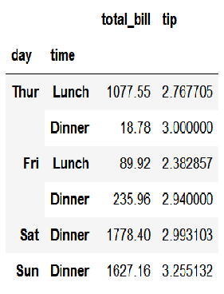
